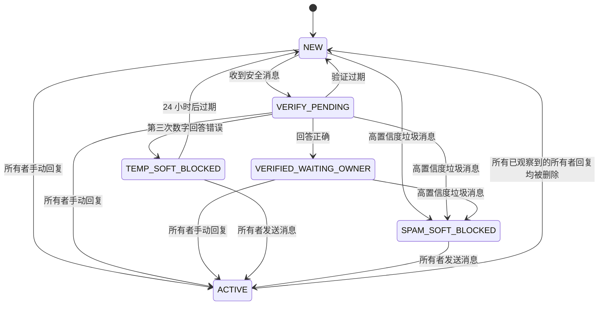

# ChatHygiene

**中文 | [English](README_en.md)**

## 介绍

ChatHygiene 是一个可自行托管的 Rust 服务，通过已连接的 Business 机器人，在账号所有者回复前验证 Telegram Business 私信的新发件人，并在启用后删除高置信度垃圾消息。由于 Telegram 会先送达消息、再将更新发送给机器人，消息可能会在 ChatHygiene 处理或删除前短暂出现在通知或聊天列表中。

首个版本有意将每个部署限制为仅服务一个已配置的 Telegram 账号。它会忽略属于其他账号的 Business 连接，并确认收到未知连接的更新，但不会创建对话状态或保留消息正文。

[介绍](#介绍) · [功能](#功能) · [预览](#预览) · [快速开始](#快速开始) · [要求](#要求) · [安装](#安装) · [使用](#使用) · [配置](#配置) · [项目结构](#项目结构) · [开发](#开发) · [测试](#测试) · [构建与部署](#构建与部署) · [文档](#文档) · [故障排查](#故障排查) · [贡献](#贡献) · [许可证](#许可证)

## 功能

- **陌生联系人验证：** 第一条安全私信会触发一道两分钟有效的算术题，答对后消息仍保持可见，等待账号所有者决定是否回复。
- **本地垃圾检测：** 确定性规则会检查文本、说明文字与 Telegram 实体，不下载附件、不调用外部信誉服务或 LLM。
- **明确的删除阈值：** 只有分数为 `100` 的 `SPAM` 结果才可能触发清理；`SUSPICIOUS` 消息始终保留给所有者查看。
- **默认试运行：** 首次部署默认不执行自动标记已读、删除或软屏蔽，并向可信所有者发送不含消息正文的 dry-run 追踪。
- **所有者回复即信任：** 所有者手动回复后，对话进入 `ACTIVE`，ChatHygiene 不再检查该对话，直到旧回复全部删除或显式执行 `/reset`。
- **开放放行与持久恢复：** 检测、权限或 Telegram 调用失败时保留消息；SQLite 会恢复已记录事件和待处理发件箱操作。
- **单账号、自托管：** 每个部署只服务一个 Telegram 账号，普通消息正文不会被有意持久化，显式标注样本除外。

## 预览

典型流程如下：

```text
陌生私信 -> 本地垃圾检测 -> 安全消息发起算术验证
                         -> 高置信度垃圾消息进入清理候选
所有者手动回复 -> ACTIVE，不再检测该对话
```

首次验收保持 dry-run。所有者先在普通机器人私聊中确认状态：

```text
/health
status=ok connection=enabled dry_run=on
```

高置信度垃圾测试会产生类似下面的追踪节选；真实追踪还包含更新、联系人、消息、事件、状态和规则元数据。`SKIPPED_DRY_RUN` 表示删除和软屏蔽没有执行，测试消息仍然可见。

```text
[DRY-RUN 追踪]
检测：
- 判定：SPAM
- 分数：100
验证：
- 结果：NOT_EVALUATED_SPAM_FIRST
操作：
- RECORD_MESSAGE：APPLIED
- DELETE_MESSAGE：SKIPPED_DRY_RUN
- SPAM_BLOCK：SKIPPED_DRY_RUN
```

## 快速开始

下面的最短路径以“约 10 分钟启动本地服务并通过 `/health/ready`”为目标，适用于使用**全新 SQLite 数据库**的部署。它假设[要求](#要求)已经满足，只使用 GitHub Release 的预编译镜像归档，不拉取镜像，也不在 VPS 上编译源码。这个时间目标不包括 Telegram webhook、Business 连接与权限验收；这些仍须继续完成[安装](#安装)中的步骤。

1. 从[最新 Release](https://github.com/lingxing1017/chat-hygiene/releases/latest)下载与 VPS 架构匹配的 Docker 镜像归档，同时取得该 Release 对应源码版本中的 `compose.yml` 和 `.env.example`。将三者放入同一部署目录。
2. 使用新的部署目录，在其中创建配置和全新数据目录。这里故意使用 `mkdir data` 而不是 `mkdir -p data`：如果 `data/` 已存在，命令会失败；不要删除它，先按[安装](#安装)中的数据策略确认应迁移还是全新初始化。

   ```bash
   cp .env.example .env
   chmod 600 .env
   mkdir data
   ```

3. 按[配置](#配置)填写四个必填值，并保持 `CHATHYGIENE_DESTRUCTIVE_MODE=false`。
4. 确认架构，导入匹配的镜像归档并启动：

   ```bash
   uname -m
   docker load -i chathygiene-amd64-YYYY.MM.DD.tar
   docker compose up -d
   docker compose ps
   ```

   `x86_64` 使用 `amd64` 归档；`aarch64`/ARM 使用 `arm64` 归档和对应文件名。

5. 验证本机服务：

   ```bash
   set -a
   source .env
   set +a
   host_port="${CHATHYGIENE_PORT:-8080}"

   curl --fail "http://127.0.0.1:${host_port}/health/live"
   curl --fail "http://127.0.0.1:${host_port}/health/ready"
   docker compose logs --since=10m chathygiene
   ```

`/health/ready` 成功只证明进程、配置、数据库迁移和本地恢复已完成，不证明公开 HTTPS、Telegram webhook、Business 连接或权限可用。不要在完成 dry-run 验收前执行 `/dry_run off`。

## 要求

- Linux VPS，CPU 架构为 `x86_64`/`amd64` 或 `aarch64`/`arm64`；
- Docker Engine 与 Docker Compose v2 插件；
- `curl` 与 `openssl`；迁移或高级排障时建议安装 `sha256sum` 和 `sqlite3`；
- 可从公网访问的 HTTPS 地址，以及负责 TLS 终止的反向代理、隧道或入口网关；
- 由 BotFather 创建并启用 Business 或 Secretary 支持的 Telegram 机器人；
- 机器人令牌、账号所有者的 Telegram 数字用户 ID，以及两个独立生成的 32-byte 十六进制密钥；
- 首次验收所需的账号所有者普通机器人私聊和一个符合 Business 机器人范围的非联系人测试账号。

## 工作原理

账号所有者的手动回复是信任边界，不存在永久白名单。



当对话处于 `NEW`、`VERIFY_PENDING` 或 `VERIFIED_WAITING_OWNER` 状态时，每条收到的消息及其编辑都会接受垃圾检测。无论验证是否成功，普通消息都会保留可见。只有高置信度的垃圾检测结果才会触发清理。

`ACTIVE` 状态有意采用严格规则：ChatHygiene 不会在该对话中执行垃圾检测、验证、入站消息台账记录或清理。它只记录所有者手动回复的消息 ID 和 Telegram 删除更新。当 Telegram 报告所有已观察到的所有者手动回复均被删除后，对话会重新变为 `NEW`。如果清空或删除对话没有产生完整的删除更新，所有者可使用 `/reset <chat_id>` 明确开始新的 `NEW` 周期。

### 验证

第一条安全消息会在当前对话中发起一道算术验证题：

- 三个操作数和两个运算符，运算符从 `+`、`-` 和 `×` 中选择；
- 每个中间结果和最终答案都在 0 到 99 之间；
- 有效期为两分钟；
- 允许三次数字答案尝试；
- 非数字消息不会消耗尝试次数；以及
- 只发送一条机器人提示，并通过编辑该提示来显示答案错误、验证成功、已过期或次数耗尽，而不是重复发送提示。

回答正确会使对话进入 `VERIFIED_WAITING_OWNER`，在所有者回复前仍会继续检测消息。验证过期会使对话回到 `NEW`。开启破坏性模式时，连续三次数字答案错误会触发 24 小时的本地软屏蔽。已有消息仍保持可见；之后收到的消息会被标记为已读并删除。在试运行模式下，同一事件会记录为待执行建议，对话则回到 `NEW`。

### 垃圾检测

内置检测器完全在本地运行且结果确定。它会规范化 Unicode 和链接，然后根据文本、说明文字和 Telegram 实体中的以下信号进行评分：

- Telegram 邀请链接和多个不同链接；
- 推广、投资、任务、返利和空投用语；
- 钱包地址或付款目标；
- 与招揽用语同时出现的联系方式；
- 零宽字符、拆分单词或混合文字体系等规避方式；以及
- 过多的提及或表情符号。

判定边界如下：

| 分数 | 判定 | 行为 |
| --- | --- | --- |
| 0-49 | `ALLOW` | 保留消息并继续当前生命周期。 |
| 50-99 | `SUSPICIOUS` | 保留消息，供所有者检查。 |
| 100 | `SPAM` | 记录证据，并在启用时执行清理和软屏蔽。 |

系统不会检查图片、视频、语音、贴纸和文档的内容。它会检查这些媒体的文字说明，但不带文字的媒体视为中性。MVP 不包含 OCR、文件下载、外部信誉查询或 LLM 调用。检测器出错或 Telegram 权限不足时采用开放放行策略：消息会被保留。检测器故障和 Telegram 返回的权限错误也会记录给所有者查看。

确认垃圾消息且可以采取操作时，ChatHygiene 会将对话标记为已读，以每批 100 条的方式删除所有已知且符合条件的消息，进入 `SPAM_SOFT_BLOCKED`，并立即读取和删除之后收到的消息。这是一种本地软屏蔽。Telegram Bot API 不允许已连接的 Business 机器人直接屏蔽发件人、移除聊天列表项，也无法保证删除 ChatHygiene 从未观察到的消息。

## 安装

ChatHygiene 的就绪探针只证明进程、配置、数据库迁移和本地恢复已经完成，不证明 Telegram webhook、Business 连接或权限可用。第一次安装和迁移到新 VPS 都应按本节顺序完成，并在验收结束前保持试运行。

### 1. 准备 Telegram 与公开端点

1. 使用 [BotFather](https://t.me/BotFather) 创建机器人，并启用当前界面中的 Business 或 Secretary 支持。Telegram 的文档目前同时使用 [Business Mode](https://core.telegram.org/bots) 和 [Secretary Mode](https://core.telegram.org/bots/features) 两种说法。
2. 为 ChatHygiene 准备公开 HTTPS 地址。服务自身只监听明文 HTTP 8080，因此必须在反向代理、隧道或入口网关处终止 TLS。
3. 如果使用全新数据库，暂时不要连接 Telegram Business 账号：先配置并启动服务，再设置 webhook。迁移已有数据库时保留现有连接，不要仅因更换 VPS 就提前断开。

Telegram 在[已连接的 Business 机器人](https://core.telegram.org/api/bots/connected-business-bots)中说明了接收者筛选条件，并在 [`businessBotRecipients`](https://core.telegram.org/constructor/businessBotRecipients) 中列出了各个标志。更广泛的 [Telegram Business](https://core.telegram.org/api/business) 界面与订阅要求可能会变化。

当前 `compose.yml` 会发布配置的宿主机端口。若反向代理与 ChatHygiene 位于同一台 VPS，请同时使用主机防火墙限制该端口，不要让明文 8080 绕过 HTTPS 入口直接暴露到公网。

### 2. 准备部署目录

从[最新 Release](https://github.com/lingxing1017/chat-hygiene/releases/latest)下载与 VPS 架构匹配的 Docker 镜像归档，并取得同一 Release 对应源码版本中的 `compose.yml` 和 `.env.example`。可以使用 GitHub 自动提供的 Source code 归档，也可以从相同 tag 的仓库内容中单独下载这两个文件。将它们放入同一目录；部署用户不需要拉取容器镜像，也不需要在 VPS 上编译源码。

### 3. 创建配置

复制 `.env.example`，按照[配置](#配置)填写所有必填值，并保持首次启动为 dry-run：

```bash
cp .env.example .env
chmod 600 .env
```

### 4. 选择数据策略

在第一次启动新 VPS 前，必须明确选择以下一种方式。

#### 全新初始化

```bash
mkdir data
```

请在新的部署目录中执行。若命令提示 `data` 已存在，不要删除目录或其中的数据库；先确认应该迁移还是全新初始化。服务首次在这个空目录中启动时才会创建新的 SQLite 数据库。新数据库不包含旧的 Business 连接、对话状态、待发送操作、运行时 dry-run 设置或已标注样本。Telegram 不会因为 webhook 或 VPS 地址发生变化而自动重放旧的 `business_connection` 更新；设置新 webhook 后，必须断开并重新连接 Business 机器人。

#### 从旧 VPS 迁移

安全迁移原 `.env` 中的配置。继续使用同一个机器人时必须保留其 bot token 和 owner ID；保留原 `CHATHYGIENE_CHALLENGE_HMAC_KEY` 才能继续验证尚未过期的题目。可以轮换 webhook 密钥，但新 `.env` 与稍后调用 `setWebhook` 使用的值必须一致。

先在旧部署上执行 `/dry_run on`，再用 `/health` 确认 `dry_run=on`。持久化运行时设置会随数据库迁移；仅在新 VPS 的 `.env` 中写入 `CHATHYGIENE_DESTRUCTIVE_MODE=false` 不会覆盖旧的 `dry_run=off`。

然后在旧 VPS 的部署目录停止服务，再备份数据库及同名前缀的 WAL/SHM 文件。不要复制仍在写入的 SQLite 文件。

```bash
docker compose stop chathygiene
umask 077
backup_dir="../chathygiene-backup-$(date +%Y%m%d-%H%M%S)"
mkdir -p "$backup_dir"
cp -p data/chathygiene.db* "$backup_dir"/
sha256sum "$backup_dir"/chathygiene.db*
```

使用你自己的加密传输方式将整个备份目录复制到新 VPS。恢复前不要启动新服务。如果新 VPS 已经生成了数据库，先停止服务并将现有 `data/chathygiene.db*` 另行备份，不要直接覆盖唯一副本。然后把旧 VPS 的同一组文件恢复到新部署目录的 `./data/`，并再次核对校验和。

当前 Compose 将宿主机的 `./data` 绑定挂载到容器的 `/data`。从使用 `chathygiene-data` 命名卷的旧版本升级时，也必须先停止旧服务，再从该命名卷导出同一组文件；应用不会自动迁移或删除旧卷。若遗漏迁移，启动时会在当前 `./data` 中创建空数据库。

### 5. 启动并验证本地服务

GitHub Release 提供已经编译好的 Linux Docker 镜像归档：`amd64` 对应常见的 `x86_64` VPS，`arm64` 对应 `aarch64`/ARM VPS。先运行 `uname -m` 确认架构，再从[最新 Release](https://github.com/lingxing1017/chat-hygiene/releases/latest)下载匹配的文件：

- `chathygiene-amd64-YYYY.MM.DD.tar`
- `chathygiene-arm64-YYYY.MM.DD.tar`

将下载的归档放到包含 `compose.yml` 的部署目录，然后运行：

```bash
set -a
source .env
set +a
host_port="${CHATHYGIENE_PORT:-8080}"

docker load -i chathygiene-amd64-YYYY.MM.DD.tar
docker compose up -d
docker compose ps
curl --fail "http://127.0.0.1:${host_port}/health/live"
curl --fail "http://127.0.0.1:${host_port}/health/ready"
docker compose logs --since=10m chathygiene
```

还应从 VPS 外部访问一次 `https://你的域名/health/ready`，确认 DNS、TLS 和反向代理确实指向新服务。本机的 `/health/ready` 成功不能证明公开入口可达。

应用只公开以下路由：

| 路由 | 证明的范围 |
| --- | --- |
| `GET /health/live` | 进程正在响应。 |
| `GET /health/ready` | 配置、数据库迁移和本地恢复已完成；不证明 Telegram 可用。 |
| `POST /telegram/webhook` | 经过密钥验证的 Telegram 更新入口。 |

### 6. 设置并检查 webhook

下面的 `curl` 在宿主机 shell 中运行，因此必须先显式加载 `.env`；仅让 Docker Compose 读取 `.env` 不会给当前 shell 设置这些变量。

```bash
set -a
source .env
set +a

webhook_url="https://example.com/telegram/webhook"
curl --fail --silent --show-error --request POST \
  "https://api.telegram.org/bot${CHATHYGIENE_BOT_TOKEN}/setWebhook" \
  --data-urlencode "url=${webhook_url}" \
  --data-urlencode "secret_token=${CHATHYGIENE_WEBHOOK_SECRET}" \
  --data-urlencode 'allowed_updates=["business_connection","business_message","edited_business_message","deleted_business_messages","message"]'

curl --fail --silent --show-error \
  "https://api.telegram.org/bot${CHATHYGIENE_BOT_TOKEN}/getWebhookInfo"
```

检查 `getWebhookInfo` 返回的 `url`、`allowed_updates`、`pending_update_count` 和 `last_error_message`。正常的 `allowed_updates` 必须包含普通 `message`，否则所有者命令不会送达。重新部署时不要随意设置 `drop_pending_updates=true`，它会丢弃 Telegram 尚未投递的更新。

ChatHygiene 会在解析 JSON 前检查 `X-Telegram-Bot-Api-Secret-Token`，拒绝超过 256 KiB 的请求正文。webhook 对错误密钥返回 `403`，对格式错误的 JSON 返回 `400`，对无法持久处理的更新返回 `503`。重复的更新 ID 可幂等处理。

### 7. 建立或恢复 Business 连接

- **全新数据库：** 在 webhook 已指向新 VPS 后，进入 Telegram 的 Business 聊天自动化设置。如果机器人原本已连接，先断开再重新连接，以触发新的 `business_connection` 更新。
- **已迁移数据库：** 如果保留了原连接且稍后的 `/health` 正常，可以继续使用。不要为了测试而不必要地重连；重连可能产生新的连接 ID。

连接的账号必须与 `CHATHYGIENE_OWNER_USER_ID` 完全一致，并授予全部四项权限：

- 回复消息；
- 将消息标记为已读；
- 删除已发送的消息；
- 删除收到的消息或所有消息。

将机器人范围设置为来自非联系人的新聊天。除非已有聊天和联系人也应进入验证生命周期，否则将其排除。

仅配置 `CHATHYGIENE_OWNER_USER_ID` 不会在空数据库中创建可信所有者。可信关系来自 Telegram 的 `business_connection` 更新或迁移后的连接记录。在此之前，dry-run 追踪没有安全的收件人，未知 Business 连接的消息也会被确认接收但安全忽略。

### 8. 在试运行中验收，再启用真实操作

1. 保持 `CHATHYGIENE_DESTRUCTIVE_MODE=false`。
2. 从已配置所有者的**普通机器人私聊**发送 `/health`，不要通过 Business 会话发送。预期收到：

   ```text
   status=ok connection=enabled dry_run=on
   ```

3. 用符合 Business 机器人范围的非联系人测试账号发送一条普通新私信。确认测试账号收到验证题，所有者收到不含消息正文的 `[DRY-RUN 追踪]`。这一步验证 webhook、连接、检测、验证题和追踪链路。
4. 再次用 `/health` 确认仍为 `dry_run=on`，然后让同一测试账号发送下面这条项目测试夹具中的高置信度垃圾文本：

   ```text
   Contact me for promotion and guaranteed investment returns. Pay 0x1234567890abcdef1234567890abcdef12345678
   ```

   预期追踪显示判定 `SPAM`、分数 `100`，并包含 `DELETE_MESSAGE：SKIPPED_DRY_RUN` 和 `SPAM_BLOCK：SKIPPED_DRY_RUN`；测试消息仍应可见。若 `/health` 不是 `dry_run=on`，不要发送这条测试消息。
5. 发送 `/errors 10`，确认没有权限或投递错误。检查 `docker compose logs --since=10m chathygiene`。
6. 只有在上述检查都通过后，才发送 `/dry_run off`。返回 `dry_run=off` 表示运行时设置已持久化，并且存储的连接状态与四项权限标志通过检查。
7. `/dry_run off` 本身仍会产生最后一条 `[DRY-RUN 追踪]`：该更新按开始处理时的旧模式记录。随后再次发送 `/health`，预期得到 `dry_run=off`，且不再产生 dry-run 追踪。

关闭 dry-run 后，自动标记已读、删除和本地软屏蔽都会真实生效。存储的权限标志通过检查并不等于一次真实 Telegram 删除已经成功；如果 Telegram 在实际调用时返回权限错误，ChatHygiene 会禁用连接、强制恢复 dry-run 并保留消息。

### 不使用容器运行

```bash
mkdir -p data
set -a
source .env
set +a
cargo run --locked
```

## 使用

命令仅接受来自已配置数字用户 ID 所有者、发送到机器人的普通私聊消息。以 Business 消息发送的命令会被视为所有者手动回复，而不是管理命令。

| 命令 | 结果 |
| --- | --- |
| `/health` | `status=ok connection=enabled|disabled dry_run=on|off` |
| `/inspect <chat_id>` | 查看当前状态、屏蔽原因和屏蔽次数。 |
| `/reset <chat_id>` | 删除机器人已记录的会话消息，清理本地会话数据，并将任意状态重置为 `NEW`。 |
| `/unblock <chat_id>` | 清除临时或持久的本地软屏蔽。 |
| `/dry_run on` | 立即禁用自动破坏性操作并持久化覆盖设置；明确执行的 `/reset` 除外。 |
| `/dry_run off` | 仅当连接已启用且四项权限齐全时启用破坏性操作。 |
| `/errors [1..20]` | 显示最近带时间戳的错误代码/消息记录；默认为 10 条。 |
| `/mark_spam` | 将所回复消息的文本或说明文字存为已标注的垃圾样本。 |
| `/mark_ham` | 将所回复消息的文本或说明文字存为已标注的正常样本。 |

要标注样本，请先将其转发或复制到普通的私人机器人聊天中，然后回复该消息并发送 `/mark_spam` 或 `/mark_ham`。只有这两个命令会有意持久化消息正文。

Telegram 上报最后一条所有者手动回复被删除时，`ACTIVE` 会自动回到 `NEW`。如果清空记录或删除对话没有产生删除更新，可使用 `/reset <chat_id>`：它接受包括 `ACTIVE` 在内的任意状态，将所有已知且未删除的消息（包括已确认发送的验证题）加入 Telegram 删除队列，清除本地消息台账和验证记录，并开始新的 `NEW` 周期。回复中的 `telegram_delete=queued` 表示删除请求已持久化到发件箱，不表示 Telegram 已经完成删除；最终失败可通过 `/errors` 查看。`/unblock` 仍只清除本地软屏蔽，不删除消息或会话数据。

## 配置

复制示例文件并填写所有必填值：

```bash
cp .env.example .env
chmod 600 .env
```

| 变量 | 必填 | 默认值 | 说明 |
| --- | --- | --- | --- |
| `CHATHYGIENE_BOT_TOKEN` | 是 | - | BotFather 签发的令牌。 |
| `CHATHYGIENE_WEBHOOK_SECRET` | 是 | - | Telegram 随 webhook 请求发送的密钥；使用 `openssl rand -hex 32` 生成。 |
| `CHATHYGIENE_CHALLENGE_HMAC_KEY` | 是 | - | 用于验证算术题答案真实性的私钥；再次运行 `openssl rand -hex 32` 独立生成，不得复用 webhook 密钥。 |
| `CHATHYGIENE_OWNER_USER_ID` | 是 | - | 此服务所服务账号的 Telegram 数字用户 ID；不是机器人 ID、用户名或手机号。 |
| `CHATHYGIENE_DATABASE_URL` | 否 | `sqlite://data/chathygiene.db` | SQLite 连接 URL。Compose 固定设置为 `sqlite:///data/chathygiene.db`。 |
| `CHATHYGIENE_DESTRUCTIVE_MODE` | 否 | `false` | 仅在没有持久化运行时设置时使用的启动默认值；`false` 表示试运行。 |
| `CHATHYGIENE_PORT` | 仅 Compose | `8080` | 映射到应用固定 8080 端口的主机端口。 |
| `RUST_LOG` | 否 | 取决于运行环境 | `tracing` 过滤器，例如 `info` 或 `chathygiene=debug`。 |

如果是全新机器人且还没有设置 webhook，可先给机器人发送一条普通私聊消息，再调用 `getUpdates`，从 `result[].message.from.id` 读取 owner 数字 ID：

```bash
set -a
source .env
set +a
curl --fail --silent --show-error \
  "https://api.telegram.org/bot${CHATHYGIENE_BOT_TOKEN}/getUpdates"
```

webhook 生效后不能同时使用 `getUpdates`。不要为了查询 ID 删除一个正在工作的 webhook，也不要把 Business 联系人的 `chat.id` 当作 owner ID。

不要提交 `.env`、SQLite 数据库及其 WAL/SHM 文件、日志或机器人令牌。应用自身不会读取 `.env`；Docker Compose 会通过 `env_file` 注入它，直接运行二进制时则必须由 shell 或服务管理器导出。

`CHATHYGIENE_DESTRUCTIVE_MODE` 只是启动默认值。所有者执行 `/dry_run on` 或 `/dry_run off` 后，SQLite 中的运行时设置会在重启后继续优先于 `.env`。试运行会阻止自动破坏性操作，但显式执行的 `/reset <chat_id>` 仍会实际删除机器人已知的消息。

## 隐私与保留期限

普通消息正文和说明文字仅在内存中存在，直到更新完成分类。持久化的生命周期事件会存储 ID、状态、规范化哈希、规则证据和检测器元数据，但不会存储正文。明确标注的垃圾/正常样本会保留正文，直到从 SQLite 中手动删除。

内置保留任务每 15 秒检查一次过期数据，并每小时清理一次历史记录：

| 数据 | 保留期限 |
| --- | --- |
| 普通入站消息 ID | 72 小时，待删除操作仍需使用时除外。 |
| 所有者手动回复 ID | 保留到 Telegram 上报删除或所有者执行 `/reset`。 |
| 已应用的更新记录 | 当没有发件箱/审计记录仍引用它们时保留 7 天。 |
| 成功的发件箱操作 | 30 天。 |
| 失败或结果不确定的发件箱操作 | 90 天。 |
| 待处理或正在重试的发件箱操作 | 保留至终态。 |
| 详细审计事件 | 90 天，同时为每个持久垃圾屏蔽保留最新一条审计记录。 |
| 对话和持久屏蔽 | 不自动清理。 |
| Business 连接、规则元数据和已标注样本 | 不自动清理。 |
| 验证记录和出站消息台账 ID | 不自动清理；执行 `/reset` 时清理目标会话。 |

SQLite 可以轻松容纳很大的本地软屏蔽索引，因为其中主要是数字 ID 和时间戳；最需要严格处理的数据是消息正文。

如需一致性备份，请停止服务，并从当前 bind-mounted `./data` 或旧命名卷中复制 `chathygiene.db*` 文件。仅在服务停止时恢复同一组文件，然后启动服务并等待 `/health/ready`。不要只复制正在运行的数据库主文件。

日志采用结构化 JSON。即使系统不会有意记录普通消息正文，也应将日志和 `/errors` 输出视为运维敏感信息。

## 恢复与故障行为

ChatHygiene 采用开放放行策略：机器人、连接、权限、检测器或清理操作发生故障时，不会隐藏尚未分类的私聊消息。

- 启动时会在就绪前重放处于 `RECORDED` 状态的持久生命周期事件。
- 待处理和已到重试时间的发件箱操作会在重启后恢复。
- 发送验证题时发生超时会标记为 `UNCERTAIN`，且绝不会自动重发，以避免提示重复。所有者会收到提醒，并可使用 `/reset <chat_id>` 清理受影响的会话。发送结果不确定且 Telegram 没有返回消息 ID 时，机器人无法自动删除那条未知消息。
- Telegram 限流和可重试的服务器故障会使用有界重试。
- Telegram 返回权限错误时，会禁用已存储的 Business 连接、强制进入试运行并保留消息。请恢复权限或重新连接机器人，检查 `/health`，然后再明确使用 `/dry_run off`。
- 如果垃圾清理失败，请检查 `/errors`，必要时手动删除消息，并且仅在确实需要清除本地屏蔽时使用 `/unblock <chat_id>`。已删除的消息无法重建。
- 如果 Telegram 漏发所有者回复的删除更新，对话可能一直保持 `ACTIVE`；使用 `/reset <chat_id>` 可明确结束旧周期并清理机器人已知的消息。

如果机器人令牌泄露，请在 BotFather 中轮换令牌并重新设置 webhook。在 Telegram 和 `.env` 中同时轮换 webhook 密钥。轮换验证题 HMAC 密钥会使当前有效答案失效；请等待两分钟使其过期，或重置受影响的对话。

## 已知限制

- 无法在 Telegram 中原生屏蔽用户或删除聊天列表项。
- 无法获取 Telegram 历史记录；清理范围仅包括已观察到的消息 ID。
- 所有者手动回复并使状态变为 `ACTIVE` 后不再检查。
- 无法保证 Telegram 会在客户端清空聊天后发送每一条删除更新。
- 尚不支持 OCR、附件扫描、URL 获取、外部信誉服务或本地机器学习模型。
- 不支持多账号租户、分布式队列或工作线程水平扩展。
- 不提供自动清理已标注样本或旧验证记录的命令。

这些限制是单账号 MVP 有意设置的安全边界。

## 未来的本地模型适配器

垃圾分类功能位于与模型无关的 Rust `SpamDetector` trait 之后。未来版本可以添加 ONNX Runtime、Candle 或隔离的本地 HTTP 适配器，而无需改变 Telegram 生命周期或破坏性操作策略。模型输出仍应提供证据并采用开放放行策略；高置信度删除也必须继续满足相同的显式阈值。

架构可以借鉴 [`illright/telegram-antispam`](https://github.com/illright/telegram-antispam) 的预处理、OCR 分阶段处理、审核队列和模型抽象等思路，但本仓库不包含该项目的代码、分类器或权重。未来复用任何内容前，请分别审查源代码和模型许可证；它们的条款与分发限制不能互换。

## 项目结构

| 路径 | 职责 |
| --- | --- |
| `src/main.rs` | 启动 HTTP 服务，并在 `0.0.0.0:8080` 监听。 |
| `src/app.rs` | 组装依赖、恢复流程、后台工作线程、webhook 与健康检查路由。 |
| `src/domain/` | 对话状态与允许的生命周期转换。 |
| `src/detection/` | 文本规范化、规则配置与本地垃圾检测。 |
| `src/verification/` | 由 HMAC 保护的算术验证题生成与判定。 |
| `src/processing/` | 串行生命周期处理、通知与 dry-run 追踪。 |
| `src/telegram/` | Telegram 更新解析、webhook、Bot API 客户端与发件箱投递。 |
| `src/owner/` | 所有者鉴权、命令、检查、reset、unblock 与样本标注。 |
| `src/storage/`、`migrations/` | SQLite 连接、迁移、仓储与事务工作单元。 |
| `src/events/`、`src/retention/` | 持久事件恢复、发件箱工作线程与数据保留任务。 |
| `tests/` | 单元、集成、端到端、容器配置和隐私回归测试。 |
| `.github/workflows/` | CI 与多架构 Docker 镜像归档发布。 |

## 开发

源码开发固定使用 Rust `1.96.0`。复制配置、创建本地数据目录并导出环境变量后即可直接运行：

```bash
cp .env.example .env
mkdir -p data
set -a
source .env
set +a
cargo run --locked
```

开发环境仍应从 dry-run 开始。配置要求与运行时覆盖规则见[配置](#配置)。

## 测试

执行与 CI 相同的格式、静态检查和完整测试套件：

```bash
cargo fmt --all -- --check
cargo clippy --locked --all-targets --all-features -- -D warnings
cargo test --locked --all-targets --all-features
```

测试覆盖真实 Axum 入口、SQLite 迁移与恢复、单工作线程生命周期处理、针对本地 HTTP stub 的 Telegram 发件箱行为、隐私断言、重复更新、编辑、相册、试运行、验证、软屏蔽以及 reset 清理语义。

## 构建与部署

普通部署应使用 GitHub Release 的预编译镜像归档，并按[快速开始](#快速开始)或[安装](#安装)操作。只有自行开发或需要验证本地源码改动时，才应在本机或开发机重新构建镜像：

```bash
docker build --tag chathygiene:test .
docker compose up -d --build
```

生产部署必须保留公开 HTTPS 入口、默认 dry-run、主机端口防火墙限制和持久化 `./data`。迁移旧 VPS 时按[选择数据策略](#4-选择数据策略)停止旧服务并迁移完整的 `chathygiene.db*` 文件集；不要复制仍在写入的 SQLite 主文件。

## 文档

| 主题 | 入口 |
| --- | --- |
| 首次启动 | [快速开始](#快速开始) |
| 完整 Telegram 接入 | [安装](#安装) |
| 生命周期、验证与检测 | [工作原理](#工作原理) |
| 所有者命令 | [使用](#使用) |
| 环境变量与运行时设置 | [配置](#配置) |
| 数据边界与备份 | [隐私与保留期限](#隐私与保留期限) |
| 恢复、重试与密钥轮换 | [恢复与故障行为](#恢复与故障行为) |
| 当前能力边界 | [已知限制](#已知限制) |
| 部署问题定位 | [故障排查](#故障排查) |

Telegram 接口行为以官方 [Bot API](https://core.telegram.org/bots/api) 与 [Telegram Business](https://core.telegram.org/api/business) 文档为准。

## 故障排查

先在实际部署目录收集不会泄露密钥的本地证据：

```bash
pwd
docker compose ps
ls -l data/chathygiene.db*
docker compose logs --since=10m chathygiene
```

如果宿主机已安装 `sqlite3`，可以只读检查连接和特定更新。不要直接修改数据库，也不要公开粘贴完整 `event_json`；试运行事件可能包含联系人显示名和用户名。

```bash
sqlite3 -readonly data/chathygiene.db \
  'SELECT owner_user_id, enabled, updated_at FROM business_connection;'

sqlite3 -readonly data/chathygiene.db \
  "SELECT update_id,
          json_extract(event_json, '$.facts.event_kind'),
          json_extract(event_json, '$.facts.owner_user_id')
   FROM processed_update
   ORDER BY update_id DESC
   LIMIT 10;"
```

| 现象 | 含义与影响 | 处理方式 |
| --- | --- | --- |
| `/health/ready` 正常，但机器人没有反应 | 就绪探针不检查 webhook、Business 连接或 Telegram API。 | 检查 `getWebhookInfo`，再检查是否已有正确的 `business_connection`。 |
| `dry-run trace has no trusted owner` | 当前更新和数据库都没有可信 Business owner。若它是未知 Business 连接的消息，该消息会被安全忽略。 | 若需要旧状态则恢复旧数据库；若是全新数据库，在 webhook 生效后断开并重新连接 Business 机器人，并核对数字 owner ID。 |
| `/health` 没有回复 | 命令不是来自已配置 owner 的普通私聊，或数据库中尚无唯一的 Business 连接。 | 核对发送位置、`CHATHYGIENE_OWNER_USER_ID` 和连接记录；先解决连接引导，不要手工插入 owner。 |
| `/dry_run off` 返回成功后仍收到一条追踪 | 切换命令按更新开始时仍开启的 dry-run 模式留下最后一条追踪。 | 再发 `/health`；应显示 `dry_run=off`，并且不再有追踪。 |
| `/health` 显示 `connection=disabled` | 存储的连接曾被 Telegram 权限错误禁用。 | 在 Telegram 恢复全部四项权限或重新连接，确认 `/health` 后再明确执行 `/dry_run off`。 |
| 新 VPS 启动后历史状态全部消失 | 当前 `./data` 是空目录、从错误目录启动 Compose，或旧命名卷/旧 VPS 数据未迁移。 | 停止服务，先备份当前数据库，再从停止状态下取得的旧数据库、WAL 和 SHM 文件恢复。 |
| webhook 持续返回 `503` | 更新未能持久记录或应用，Telegram 会重试。 | 查看同一时间的结构化日志和 `/errors 10`；不要通过丢弃待处理更新来掩盖问题。 |

## 贡献

1. 从最新代码创建范围明确的分支，避免把功能、重构、部署和文档混在同一变更中。
2. 为行为变化补充相应测试，并保持 dry-run、隐私与开放放行边界不变，除非变更本身明确修改这些契约。
3. 提交前运行[测试](#测试)中的全部命令；涉及容器时同时验证 Docker 构建和 Compose 配置。
4. Pull Request 应说明动机、行为变化、风险与验证证据。不要提交 `.env`、令牌、数据库、WAL/SHM、日志、构建产物或其他本机数据。

## 许可证

本项目采用 [GNU Affero General Public License v3.0 or later](https://www.gnu.org/licenses/agpl-3.0.html)，SPDX 标识为 `AGPL-3.0-or-later`。
