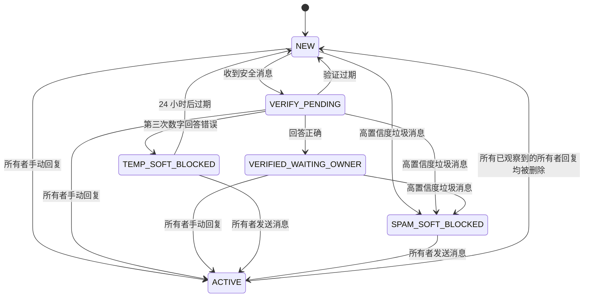

# ChatHygiene

**[English](README_en.md) · 中文**

ChatHygiene 是一个可自行托管的 Rust 服务，通过已连接的 Business 机器人，在账号所有者回复前验证 Telegram Business 私信的新发件人，并在启用后删除高置信度垃圾消息。由于 Telegram 会先送达消息、再将更新发送给机器人，消息可能会在 ChatHygiene 处理或删除前短暂出现在通知或聊天列表中。

首个版本有意将每个部署限制为仅服务一个已配置的 Telegram 账号。它会忽略属于其他账号的 Business 连接，并确认收到未知连接的更新，但不会创建对话状态或保留消息正文。

## 行为

账号所有者的手动回复是信任边界，不存在永久白名单。



当对话处于 `NEW`、`VERIFY_PENDING` 或 `VERIFIED_WAITING_OWNER` 状态时，每条收到的消息及其编辑都会接受垃圾检测。无论验证是否成功，普通消息都会保留可见。只有高置信度的垃圾检测结果才会触发清理。

`ACTIVE` 状态有意采用严格规则：ChatHygiene 不会在该对话中执行垃圾检测、验证、入站消息台账记录或清理。它只记录所有者手动回复的消息 ID 和 Telegram 删除更新。当 Telegram 报告所有已观察到的所有者手动回复均被删除后，对话会重新变为 `NEW`。因此，只要 Telegram 发出了删除更新，清空对话就会使发件人再次接受验证。

### 验证

第一条安全消息会在当前对话中发起一道算术验证题：

- 三个操作数和两个运算符，运算符从 `+`、`-` 和 `×` 中选择；
- 每个中间结果和最终答案都在 0 到 99 之间；
- 有效期为两分钟；
- 允许三次数字答案尝试；
- 非数字消息不会消耗尝试次数；以及
- 只发送一条机器人提示，并通过编辑该提示来显示答案错误、验证成功、已过期或次数耗尽，而不是重复发送提示。

回答正确会使对话进入 `VERIFIED_WAITING_OWNER`，在所有者回复前仍会继续检测消息。验证过期会使对话回到 `NEW`。开启破坏性模式时，连续三次数字答案错误会触发 24 小时的本地软屏蔽。已有消息仍保持可见；之后收到的消息会被标记为已读并删除。在试运行模式下，同一事件会记录为待执行建议，对话则回到 `NEW`。

### 垃圾检测

内置检测器完全在本地运行且结果确定。它会规范化 Unicode 和链接，然后根据文本、说明文字和 Telegram 实体中的以下信号进行评分：

- Telegram 邀请链接和多个不同链接；
- 推广、投资、任务、返利和空投用语；
- 钱包地址或付款目标；
- 与招揽用语同时出现的联系方式；
- 零宽字符、拆分单词或混合文字体系等规避方式；以及
- 过多的提及或表情符号。

判定边界如下：

| 分数 | 判定 | 行为 |
| --- | --- | --- |
| 0-49 | `ALLOW` | 保留消息并继续当前生命周期。 |
| 50-99 | `SUSPICIOUS` | 保留消息，供所有者检查。 |
| 100 | `SPAM` | 记录证据，并在启用时执行清理和软屏蔽。 |

系统不会检查图片、视频、语音、贴纸和文档的内容。它会检查这些媒体的文字说明，但不带文字的媒体视为中性。MVP 不包含 OCR、文件下载、外部信誉查询或 LLM 调用。检测器出错或 Telegram 权限不足时采用开放放行策略：消息会被保留。检测器故障和 Telegram 返回的权限错误也会记录给所有者查看。

确认垃圾消息且可以采取操作时，ChatHygiene 会将对话标记为已读，以每批 100 条的方式删除所有已知且符合条件的消息，进入 `SPAM_SOFT_BLOCKED`，并立即读取和删除之后收到的消息。这是一种本地软屏蔽。Telegram Bot API 不允许已连接的 Business 机器人直接屏蔽发件人、移除聊天列表项，也无法保证删除 ChatHygiene 从未观察到的消息。

## Telegram 前置条件

1. 使用 [BotFather](https://t.me/BotFather) 创建机器人。
2. 启用当前 BotFather 界面中显示的 Business 或 Secretary 支持。Telegram 的文档目前同时使用 [Business Mode](https://core.telegram.org/bots) 和 [Secretary Mode](https://core.telegram.org/bots/features) 两种说法。
3. 将 ChatHygiene 部署在一个公开的 HTTPS 端点之后。服务自身监听明文 HTTP 8080 端口，因此需要在反向代理、隧道或入口网关处终止 TLS。
4. 配置并启动 ChatHygiene，然后按照下方说明设置 webhook，之后再连接 Business 账号。
5. 在 Telegram 的 Business 聊天自动化设置中，将机器人连接到 `CHATHYGIENE_OWNER_USER_ID` 标识的账号。
6. 授予此版本使用的全部四项权限：
   - 回复消息；
   - 将消息标记为已读；
   - 删除已发送的消息；以及
   - 删除收到的消息或所有消息。
7. 将机器人范围设置为来自非联系人的新聊天。除非已有聊天和联系人也应进入验证生命周期，否则请将其排除。

Telegram 在[已连接的 Business 机器人](https://core.telegram.org/api/bots/connected-business-bots)中说明了可用的接收者筛选条件，并在 [`businessBotRecipients`](https://core.telegram.org/constructor/businessBotRecipients) 中列出了各个标志。更广泛的 [Telegram Business](https://core.telegram.org/api/business) 界面与订阅要求可能会变化；官方页面目前说明，连接机器人无需 Premium，而大多数其他 Business 功能需要 Premium。

设置 webhook 时，只包含 ChatHygiene 会处理的更新类型。普通私聊的所有者命令通道需要 `message` 类型。

```bash
curl --request POST \
  "https://api.telegram.org/bot${CHATHYGIENE_BOT_TOKEN}/setWebhook" \
  --data-urlencode "url=https://example.com/telegram/webhook" \
  --data-urlencode "secret_token=${CHATHYGIENE_WEBHOOK_SECRET}" \
  --data-urlencode 'allowed_updates=["business_connection","business_message","edited_business_message","deleted_business_messages","message"]'
```

官方 [`setWebhook` 文档](https://core.telegram.org/bots/api#setwebhook)说明了密钥请求头和公开 HTTPS 的要求。ChatHygiene 会在解析 JSON 前检查 `X-Telegram-Bot-Api-Secret-Token`，拒绝超过 256 KiB 的请求正文，并且只公开以下应用路由：

| 路由 | 用途 |
| --- | --- |
| `GET /health/live` | 进程存活检查。 |
| `GET /health/ready` | 配置、数据库、迁移和恢复均已完成。 |
| `POST /telegram/webhook` | 经过身份验证的 Telegram 更新。 |

webhook 会对缺失或错误的密钥返回 `403`，对格式错误的 JSON 返回 `400`，并在更新无法持久处理时返回 `503`。重复的更新 ID 可幂等处理。一个 Business 生命周期中的事件由单个有界工作线程串行处理；相互独立的 HTTP 请求仍可并发到达。

## 配置

复制示例文件并填写所有必填值：

```bash
cp .env.example .env
```

| 变量 | 必填 | 默认值 | 说明 |
| --- | --- | --- | --- |
| `CHATHYGIENE_BOT_TOKEN` | 是 | - | BotFather 签发的令牌。 |
| `CHATHYGIENE_WEBHOOK_SECRET` | 是 | - | Telegram 随 webhook 请求发送的密钥。 |
| `CHATHYGIENE_CHALLENGE_HMAC_KEY` | 是 | - | 用于验证算术题答案真实性的私钥。 |
| `CHATHYGIENE_OWNER_USER_ID` | 是 | - | 此服务所服务的唯一账号，其 Telegram 用户 ID 必须为正整数。 |
| `CHATHYGIENE_DATABASE_URL` | 否 | `sqlite://data/chathygiene.db` | SQLite 连接 URL。Compose 会设置为 `sqlite:///data/chathygiene.db`。 |
| `CHATHYGIENE_DESTRUCTIVE_MODE` | 否 | `false` | 启动时的默认值；`false` 表示试运行。 |
| `CHATHYGIENE_PORT` | 仅 Compose | `8080` | 映射到应用固定 8080 端口的主机端口。 |
| `RUST_LOG` | 否 | 取决于运行环境 | `tracing` 过滤器，例如 `info` 或 `chathygiene=debug`。 |

请生成彼此独立的高熵密钥，例如：

```bash
openssl rand -hex 32
```

不要将 webhook 密钥复用为 HMAC 密钥。不要提交 `.env`、SQLite 数据库及其 WAL/SHM 文件、日志或机器人令牌。

`CHATHYGIENE_DESTRUCTIVE_MODE` 只是启动时的默认值。一旦所有者使用 `/dry_run on` 或 `/dry_run off`，持久化的运行时设置会在重启后继续优先于该值。

## 使用 Docker Compose 运行

推荐使用 Docker Compose 部署：

```bash
docker compose up -d --build
curl --fail http://127.0.0.1:8080/health/ready
docker compose logs -f chathygiene
```

镜像使用 Rust 1.96 构建，以非特权 `chathygiene` 用户运行，并将 SQLite 数据存储在名为 `chathygiene-data` 的卷中。初次观察时请保持 `CHATHYGIENE_DESTRUCTIVE_MODE=false`。连接机器人，确认 `/health`，检查试运行证据，然后再从已授权的私人机器人聊天中发送 `/dry_run off`。

不使用容器运行：

```bash
mkdir -p data
set -a
source .env
set +a
cargo run --locked
```

应用自身不会读取 `.env`；必须由 shell 或服务管理器导出这些变量。

## 所有者命令

命令仅接受来自已配置数字用户 ID 所有者、发送到机器人的普通私聊消息。以 Business 消息发送的命令会被视为所有者手动回复，而不是管理命令。

| 命令 | 结果 |
| --- | --- |
| `/health` | `status=ok connection=enabled|disabled dry_run=on|off` |
| `/inspect <chat_id>` | 查看当前状态、屏蔽原因和屏蔽次数。 |
| `/reset <chat_id>` | 关闭验证，并使非 `ACTIVE` 对话回到 `NEW`。 |
| `/unblock <chat_id>` | 清除临时或持久的本地软屏蔽。 |
| `/dry_run on` | 立即禁用破坏性操作并持久化覆盖设置。 |
| `/dry_run off` | 仅当连接已启用且四项权限齐全时启用破坏性操作。 |
| `/errors [1..20]` | 显示最近带时间戳的错误代码/消息记录；默认为 10 条。 |
| `/mark_spam` | 将所回复消息的文本或说明文字存为已标注的垃圾样本。 |
| `/mark_ham` | 将所回复消息的文本或说明文字存为已标注的正常样本。 |

要标注样本，请先将其转发或复制到普通的私人机器人聊天中，然后回复该消息并发送 `/mark_spam` 或 `/mark_ham`。只有这两个命令会有意持久化消息正文。

只要仍存在任何已观察到的所有者手动回复，`/reset` 就会拒绝重置 `ACTIVE` 对话。`/unblock` 只会改变本地状态，无法恢复已删除的消息。所有者直接向被屏蔽的 Business 对话发送消息具有最高权威性：它会清除本地屏蔽并使对话进入 `ACTIVE`。

## 隐私与保留期限

普通消息正文和说明文字仅在内存中存在，直到更新完成分类。持久化的生命周期事件会存储 ID、状态、规范化哈希、规则证据和检测器元数据，但不会存储正文。明确标注的垃圾/正常样本会保留正文，直到从 SQLite 中手动删除。

内置保留任务每 15 秒检查一次过期数据，并每小时清理一次历史记录：

| 数据 | 保留期限 |
| --- | --- |
| 普通入站消息 ID | 72 小时，待删除操作仍需使用时除外。 |
| 所有者手动回复 ID | 予以保留，以便通过删除更新重置 `ACTIVE`。 |
| 已应用的更新记录 | 当没有发件箱/审计记录仍引用它们时保留 7 天。 |
| 成功的发件箱操作 | 30 天。 |
| 失败或结果不确定的发件箱操作 | 90 天。 |
| 待处理或正在重试的发件箱操作 | 保留至终态。 |
| 详细审计事件 | 90 天，同时为每个持久垃圾屏蔽保留最新一条审计记录。 |
| 对话和持久屏蔽 | 不自动清理。 |
| Business 连接、规则元数据和已标注样本 | 不自动清理。 |
| 验证记录和出站消息台账 ID | MVP 中不自动清理。 |

SQLite 可以轻松容纳很大的本地软屏蔽索引，因为其中主要是数字 ID 和时间戳；最需要严格处理的数据是消息正文。

如需一致性备份，请停止服务，并从命名卷中复制数据库文件及所有 `-wal` 和 `-shm` 文件。仅在服务停止时恢复同一组文件，然后启动服务并等待 `/health/ready`。请使用能够感知卷的备份工具，不要只复制正在运行的数据库文件。

日志采用结构化 JSON。即使系统不会有意记录普通消息正文，也应将日志和 `/errors` 输出视为运维敏感信息。

## 恢复与故障行为

ChatHygiene 采用开放放行策略：机器人、连接、权限、检测器或清理操作发生故障时，不会隐藏尚未分类的私聊消息。

- 启动时会在就绪前重放处于 `RECORDED` 状态的持久生命周期事件。
- 待处理和已到重试时间的发件箱操作会在重启后恢复。
- 发送验证题时发生超时会标记为 `UNCERTAIN`，且绝不会自动重发，以避免提示重复。所有者会收到提醒；当对话不处于 `ACTIVE` 时，请使用 `/reset <chat_id>`。
- Telegram 限流和可重试的服务器故障会使用有界重试。
- Telegram 返回权限错误时，会禁用已存储的 Business 连接、强制进入试运行并保留消息。请恢复权限或重新连接机器人，检查 `/health`，然后再明确使用 `/dry_run off`。
- 如果垃圾清理失败，请检查 `/errors`，必要时手动删除消息，并且仅在确实需要清除本地屏蔽时使用 `/unblock <chat_id>`。已删除的消息无法重建。
- 如果 Telegram 漏发所有者回复的删除更新，对话可能一直保持 `ACTIVE`。MVP 不提供强制重置命令，因为覆盖已观察到的所有者回复会削弱“不检查”的保证。

如果机器人令牌泄露，请在 BotFather 中轮换令牌并重新设置 webhook。在 Telegram 和 `.env` 中同时轮换 webhook 密钥。轮换验证题 HMAC 密钥会使当前有效答案失效；请等待两分钟使其过期，或重置受影响的非 `ACTIVE` 对话。

## 已知限制

- 无法在 Telegram 中原生屏蔽用户或删除聊天列表项。
- 无法获取 Telegram 历史记录；清理范围仅包括已观察到的消息 ID。
- 所有者手动回复并使状态变为 `ACTIVE` 后不再检查。
- 无法保证 Telegram 会在客户端清空聊天后发送每一条删除更新。
- 尚不支持 OCR、附件扫描、URL 获取、外部信誉服务或本地机器学习模型。
- 不支持多账号租户、分布式队列或工作线程水平扩展。
- 不提供自动清理已标注样本或旧验证记录的命令。

这些限制是单账号 MVP 有意设置的安全边界。

## 未来的本地模型适配器

垃圾分类功能位于与模型无关的 Rust `SpamDetector` trait 之后。未来版本可以添加 ONNX Runtime、Candle 或隔离的本地 HTTP 适配器，而无需改变 Telegram 生命周期或破坏性操作策略。模型输出仍应提供证据并采用开放放行策略；高置信度删除也必须继续满足相同的显式阈值。

架构可以借鉴 [`illright/telegram-antispam`](https://github.com/illright/telegram-antispam) 的预处理、OCR 分阶段处理、审核队列和模型抽象等思路，但本仓库不包含该项目的代码、分类器或权重。未来复用任何内容前，请分别审查源代码和模型许可证；它们的条款与分发限制不能互换。

## 开发

使用固定的 Rust 1.96 工具链，并执行与 CI 相同的检查：

```bash
cargo fmt --all -- --check
cargo clippy --locked --all-targets --all-features -- -D warnings
cargo test --locked --all-targets --all-features
docker build --tag chathygiene:test .
```

测试套件包括真实的 Axum 入口、SQLite 迁移与恢复、单工作线程生命周期处理、针对本地 HTTP stub 的 Telegram 发件箱行为、隐私断言、重复更新、编辑、相册、试运行、验证、软屏蔽以及 `ACTIVE` 重置语义。
