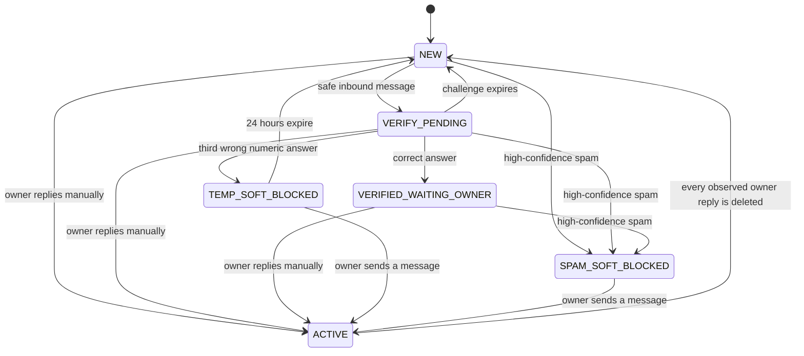

# ChatHygiene

**English · [中文](README.md)**

ChatHygiene is a self-hosted Rust service that uses a connected Business bot to
verify new senders and, when enabled, remove high-confidence spam from Telegram
Business DMs before the account owner replies. Because Telegram delivers
messages before sending their updates to the bot, they may briefly appear in
notifications or the chat list before ChatHygiene processes or deletes them.

The first release intentionally serves one configured Telegram account per
deployment. It ignores Business connections owned by other accounts and
acknowledges updates for unknown connections without creating conversation
state or retaining message bodies.

## Behavior

The owner replying manually is the trust boundary. There is no permanent
whitelist.



While a conversation is `NEW`, `VERIFY_PENDING`, or
`VERIFIED_WAITING_OWNER`, every inbound message and edit is checked for spam.
Ordinary messages remain visible regardless of whether verification succeeds.
Only a high-confidence spam result can trigger cleanup.

`ACTIVE` is deliberately strict: ChatHygiene performs no spam detection,
verification, inbound ledger tracking, or cleanup in that conversation. It
only records manual owner reply IDs and Telegram deletion updates. The
conversation becomes `NEW` again after Telegram reports that every observed
manual owner reply has been deleted. Clearing the conversation therefore
causes the sender to be challenged again, provided Telegram delivers the
deletion updates.

### Verification

The first safe message starts an in-thread arithmetic challenge:

- three operands and two operations selected from `+`, `-`, and `×`;
- every intermediate value and the final answer is between 0 and 99;
- two-minute validity;
- three numeric attempts;
- nonnumeric messages do not consume an attempt; and
- one bot prompt is edited to show incorrect, successful, expired, or
  exhausted status instead of sending repeated prompts.

A correct answer moves the conversation to `VERIFIED_WAITING_OWNER`, where
messages are still checked until the owner replies. Expiry returns it to
`NEW`. Three wrong numeric answers create a 24-hour local soft block when
destructive mode is enabled. Existing messages remain visible; subsequent
messages are marked read and deleted. In dry-run mode the same event is
recorded as a proposal and the conversation returns to `NEW`.

### Spam detection

The bundled detector is local and deterministic. It normalizes Unicode and
links, then scores text, captions, and Telegram entities for signals such as:

- Telegram invite links and multiple distinct links;
- promotional, investment, task, rebate, and airdrop language;
- wallet or payment destinations;
- contact details combined with solicitation;
- zero-width, spaced-word, or mixed-script evasion; and
- excessive mentions or emoji.

The decision boundaries are:

| Score | Decision | Behavior |
| --- | --- | --- |
| 0-49 | `ALLOW` | Keep the message and continue the lifecycle. |
| 50-99 | `SUSPICIOUS` | Keep the message for the owner to review. |
| 100 | `SPAM` | Record evidence and, if enabled, clean up and soft-block. |

Images, video, voice, stickers, and document contents are not inspected.
Their text captions are inspected, but media without text is neutral. There
is no OCR, file download, external reputation lookup, or LLM call in the MVP.
Detector errors and insufficient Telegram rights fail open: the message is
retained. Detector failures and rights errors returned by Telegram are also
recorded for the owner.

When confirmed spam is actionable, ChatHygiene marks the conversation read,
deletes every known eligible message in batches of 100, enters
`SPAM_SOFT_BLOCKED`, and immediately reads and deletes future messages. This
is a local soft block. Telegram's Bot API does not let the connected Business
bot natively block the sender, remove a chat row, or guarantee deletion of
messages that ChatHygiene never observed.

## Telegram prerequisites

1. Create a bot with [BotFather](https://t.me/BotFather).
2. Enable the Business or Secretary support shown by the current BotFather
   interface. Telegram's documentation currently uses both
   [Business Mode](https://core.telegram.org/bots) and
   [Secretary Mode](https://core.telegram.org/bots/features) terminology.
3. Deploy ChatHygiene behind a public HTTPS endpoint. The service itself
   listens on plain HTTP port 8080, so terminate TLS in a reverse proxy,
   tunnel, or ingress.
4. Configure and start ChatHygiene, then set the webhook as shown below before
   connecting the Business account.
5. In Telegram's Business chat automation settings, connect the bot to the
   account identified by `CHATHYGIENE_OWNER_USER_ID`.
6. Grant all four rights used by this release:
   - reply to messages;
   - mark messages as read;
   - delete sent messages; and
   - delete received/all messages.
7. Scope the bot to new chats from non-contacts. Exclude existing chats and
   contacts unless they should also enter the verification lifecycle.

Telegram documents the available recipient filters under
[connected Business bots](https://core.telegram.org/api/bots/connected-business-bots)
and the individual flags in
[`businessBotRecipients`](https://core.telegram.org/constructor/businessBotRecipients).
The broader [Telegram Business](https://core.telegram.org/api/business) UI and
subscription requirements can change; the official page currently states
that connected bots are available without Premium while most other Business
features require Premium.

Set the webhook with exactly the update types ChatHygiene consumes. The normal
`message` type is required for the private owner-command channel.

```bash
curl --request POST \
  "https://api.telegram.org/bot${CHATHYGIENE_BOT_TOKEN}/setWebhook" \
  --data-urlencode "url=https://example.com/telegram/webhook" \
  --data-urlencode "secret_token=${CHATHYGIENE_WEBHOOK_SECRET}" \
  --data-urlencode 'allowed_updates=["business_connection","business_message","edited_business_message","deleted_business_messages","message"]'
```

The official [`setWebhook` documentation](https://core.telegram.org/bots/api#setwebhook)
describes the secret header and public HTTPS requirements. ChatHygiene checks
`X-Telegram-Bot-Api-Secret-Token` before parsing JSON, rejects bodies larger
than 256 KiB, and exposes only these application routes:

| Route | Purpose |
| --- | --- |
| `GET /health/live` | Process liveness. |
| `GET /health/ready` | Config, database, migrations, and recovery completed. |
| `POST /telegram/webhook` | Authenticated Telegram updates. |

The webhook returns `403` for a missing or wrong secret, `400` for malformed
JSON, and `503` when an update cannot be durably processed. Duplicate update
IDs are idempotent. Events from one Business lifecycle are serialized by one
bounded worker; independent HTTP requests can still arrive concurrently.

## Configuration

Copy the example and fill every required value:

```bash
cp .env.example .env
```

| Variable | Required | Default | Description |
| --- | --- | --- | --- |
| `CHATHYGIENE_BOT_TOKEN` | yes | - | Token issued by BotFather. |
| `CHATHYGIENE_WEBHOOK_SECRET` | yes | - | Secret sent by Telegram with webhook requests. |
| `CHATHYGIENE_CHALLENGE_HMAC_KEY` | yes | - | Private key used to authenticate challenge answers. |
| `CHATHYGIENE_OWNER_USER_ID` | yes | - | Positive numeric Telegram user ID of the one account served. |
| `CHATHYGIENE_DATABASE_URL` | no | `sqlite://data/chathygiene.db` | SQLite connection URL. Compose sets `sqlite:///data/chathygiene.db`. |
| `CHATHYGIENE_DESTRUCTIVE_MODE` | no | `false` | Startup default; `false` is dry-run. |
| `CHATHYGIENE_PORT` | Compose only | `8080` | Host port mapped to the fixed application port 8080. |
| `RUST_LOG` | no | runtime dependent | `tracing` filter, for example `info` or `chathygiene=debug`. |

Generate independent high-entropy secrets, for example:

```bash
openssl rand -hex 32
```

Do not reuse the webhook secret as the HMAC key. Do not commit `.env`, the
SQLite database, its WAL/SHM files, logs, or the bot token.

`CHATHYGIENE_DESTRUCTIVE_MODE` is only the startup default. Once the owner
uses `/dry_run on` or `/dry_run off`, the persisted runtime setting takes
precedence across restarts.

## Run with Docker Compose

Docker Compose is the intended deployment path:

```bash
docker compose up -d --build
curl --fail http://127.0.0.1:8080/health/ready
docker compose logs -f chathygiene
```

The image builds with Rust 1.96, runs as an unprivileged `chathygiene` user,
and stores SQLite data in the `chathygiene-data` named volume. Keep
`CHATHYGIENE_DESTRUCTIVE_MODE=false` for initial observation. Connect the bot,
confirm `/health`, inspect dry-run evidence, and only then send `/dry_run off`
from the authorized private bot chat.

To run without a container:

```bash
mkdir -p data
set -a
source .env
set +a
cargo run --locked
```

The application does not read `.env` itself; the shell or service manager must
export the variables.

## Owner commands

Commands are accepted only as ordinary private messages to the bot from the
numeric configured owner. A command sent as a Business message is treated as
a manual owner reply, not as an administration command.

| Command | Result |
| --- | --- |
| `/health` | `status=ok connection=enabled|disabled dry_run=on|off` |
| `/inspect <chat_id>` | Current state, block reason, and block count. |
| `/reset <chat_id>` | Close a challenge and return a non-`ACTIVE` conversation to `NEW`. |
| `/unblock <chat_id>` | Clear a temporary or persistent local soft block. |
| `/dry_run on` | Disable destructive actions immediately and persist the override. |
| `/dry_run off` | Enable destructive actions only if the connection is enabled and all four rights are present. |
| `/errors [1..20]` | Show recent timestamped error code/message rows; default 10. |
| `/mark_spam` | Store the text/caption of the replied message as a labeled spam sample. |
| `/mark_ham` | Store the text/caption of the replied message as a labeled ham sample. |

To label a sample, forward or copy it into the normal private bot chat, then
reply to that message with `/mark_spam` or `/mark_ham`. These two commands are
the only paths that intentionally persist a message body.

`/reset` refuses an `ACTIVE` conversation while any observed manual owner
reply remains. `/unblock` changes only local state; it cannot restore deleted
messages. An owner message sent directly into a blocked Business conversation
is authoritative: it clears the local block and moves the conversation to
`ACTIVE`.

## Privacy and retention

Normal message bodies and captions exist only in memory while an update is
classified. Durable lifecycle events store IDs, state, normalized hashes,
rule evidence, and detector metadata, but not the body. Explicitly labeled
spam/ham samples persist their body until manually removed from SQLite.

The built-in retention worker checks expiries every 15 seconds and purges
history hourly:

| Data | Retention |
| --- | --- |
| Ordinary inbound message IDs | 72 hours, unless needed by a pending deletion. |
| Manual owner reply IDs | Kept so `ACTIVE` can be reset by deletion updates. |
| Applied update records | 7 days when no outbox/audit row still references them. |
| Successful outbox actions | 30 days. |
| Failed or uncertain outbox actions | 90 days. |
| Pending or retrying outbox actions | Kept until terminal. |
| Detailed audit events | 90 days, while preserving the newest audit for each persistent spam block. |
| Conversations and persistent blocks | Not automatically purged. |
| Business connection, rule metadata, and labeled samples | Not automatically purged. |
| Challenge rows and outbound ledger IDs | Not automatically purged in the MVP. |

SQLite can comfortably hold a large local soft-block index because it is
mostly numeric IDs and timestamps; message bodies are the data that need the
strictest handling.

For a consistent backup, stop the service and copy the database file together
with any `-wal` and `-shm` files from the named volume. Restore the same set
only while the service is stopped, then start it and wait for
`/health/ready`. Use volume-aware backup tooling rather than copying a live
database file alone.

Logs are structured JSON. Treat logs and `/errors` output as operationally
sensitive even though normal message bodies are not intentionally logged.

## Recovery and failure behavior

ChatHygiene is fail-open: loss of the bot, connection, rights, detector, or
cleanup action does not hide an unclassified private message.

- Startup replays durable `RECORDED` lifecycle events before readiness.
- Pending and due-retry outbox actions resume after restart.
- A timeout while sending a challenge is `UNCERTAIN` and is never
  automatically repeated, avoiding duplicate prompts. The owner receives an
  alert; use `/reset <chat_id>` when the conversation is not `ACTIVE`.
- Telegram rate limits and retryable server failures use bounded retries.
- A rights error returned by Telegram disables the stored Business connection,
  forces dry-run, and retains messages. Restore the rights or reconnect the
  bot, verify `/health`, then deliberately use `/dry_run off` again.
- If spam cleanup fails, inspect `/errors`, remove the messages manually if
  needed, and use `/unblock <chat_id>` only when the local block should be
  cleared. Deleted messages cannot be reconstructed.
- If Telegram misses deletion updates for owner replies, a conversation may
  remain `ACTIVE`. The MVP has no force-reset command because overriding
  observed owner replies would weaken the no-check guarantee.

Rotate a compromised bot token in BotFather and set the webhook again. Rotate
the webhook secret in both Telegram and `.env`. Rotating the challenge HMAC
key invalidates active answers; wait two minutes for expiry or reset affected
non-`ACTIVE` conversations.

## Known limits

- No native Telegram user block or chat-row deletion.
- No Telegram history fetch; cleanup covers only observed message IDs.
- No inspection after a manual owner reply while the state is `ACTIVE`.
- No guarantee that Telegram sends every deletion update after a client-side
  chat clear.
- No OCR, attachment scanning, URL fetching, external reputation service, or
  local ML model yet.
- No multi-account tenancy, distributed queue, or horizontal worker scaling.
- No automatic purge command for labeled samples or old challenge rows.

These limits are intentional safety boundaries for the single-account MVP.

## Future local-model adapter

Spam classification is behind the model-agnostic `SpamDetector` Rust trait.
A later release can add an ONNX Runtime, Candle, or isolated local HTTP adapter
without changing the Telegram lifecycle or destructive-action policy. Model
output should remain evidence-bearing and fail open; high-confidence deletion
must still require the same explicit threshold.

The architecture may borrow ideas such as preprocessing, OCR staging, review
queues, and model abstraction from
[`illright/telegram-antispam`](https://github.com/illright/telegram-antispam),
but this repository does not bundle that project's code, classifier, or
weights. Review the source and model licenses independently before any future
reuse; their terms and distribution constraints are not interchangeable.

## Development

Use the pinned Rust 1.96 toolchain and the same checks as CI:

```bash
cargo fmt --all -- --check
cargo clippy --locked --all-targets --all-features -- -D warnings
cargo test --locked --all-targets --all-features
docker build --tag chathygiene:test .
```

The test suite includes real Axum ingress, SQLite migrations and recovery,
single-worker lifecycle processing, Telegram outbox behavior against a local
HTTP stub, privacy assertions, duplicate updates, edits, albums, dry-run,
verification, soft blocks, and `ACTIVE` reset semantics.
