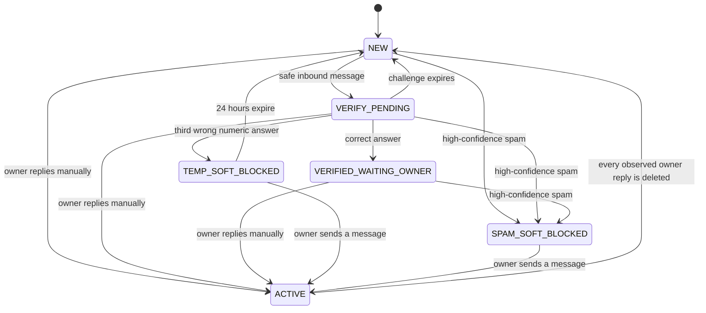

# ChatHygiene

**[中文](README.md) | English**

## Introduction

ChatHygiene is a self-hosted Rust service that uses a connected Business bot to
verify new senders and, when enabled, remove high-confidence spam from Telegram
Business DMs before the account owner replies. Because Telegram delivers
messages before sending their updates to the bot, they may briefly appear in
notifications or the chat list before ChatHygiene processes or deletes them.

The first release intentionally serves one configured Telegram account per
deployment. It ignores Business connections owned by other accounts and
acknowledges updates for unknown connections without creating conversation
state or retaining message bodies.

[Introduction](#introduction) · [Features](#features) · [Preview](#preview) · [Quick Start](#quick-start) · [Requirements](#requirements) · [Installation](#installation) · [Usage](#usage) · [Configuration](#configuration) · [Project Structure](#project-structure) · [Development](#development) · [Testing](#testing) · [Build and Deployment](#build-and-deployment) · [Documentation](#documentation) · [Troubleshooting](#troubleshooting) · [Contributing](#contributing) · [License](#license)

## Features

- **New-sender verification:** the first safe private message starts a two-minute arithmetic challenge. A correct answer keeps messages visible while the account owner decides whether to reply.
- **Local spam detection:** deterministic rules inspect text, captions, and Telegram entities without downloading attachments or calling an external reputation service or LLM.
- **Explicit deletion threshold:** only a `SPAM` score of `100` can trigger cleanup. `SUSPICIOUS` messages always remain visible for owner review.
- **Dry-run by default:** a first deployment does not automatically mark messages read, delete them, or soft-block a conversation, and sends body-free traces to the trusted owner.
- **Owner reply as trust:** after a manual owner reply, the conversation enters `ACTIVE` and ChatHygiene stops inspecting it until all old replies are deleted or the owner explicitly uses `/reset`.
- **Fail-open recovery:** detection, permission, and Telegram call failures retain messages; SQLite restores recorded events and pending outbox operations.
- **Single-account and self-hosted:** each deployment serves one Telegram account, and ordinary message bodies are not intentionally persisted except for explicitly labeled samples.

## Preview

A typical flow looks like this:

```text
new private message -> local spam detection -> safe message starts a challenge
                                           -> high-confidence spam becomes a cleanup candidate
manual owner reply -> ACTIVE; stop inspecting that conversation
```

Keep the first acceptance run in dry-run. The owner first checks status in the ordinary private bot chat:

```text
/health
status=ok connection=enabled dry_run=on
```

A high-confidence spam fixture produces a trace excerpt like the following. The complete trace also contains update, contact, message, event, state, and rule metadata. `SKIPPED_DRY_RUN` means deletion and soft-blocking did not run, so the test message remains visible.

```text
[DRY-RUN 追踪]
检测：
- 判定：SPAM
- 分数：100
验证：
- 结果：NOT_EVALUATED_SPAM_FIRST
操作：
- RECORD_MESSAGE：APPLIED
- DELETE_MESSAGE：SKIPPED_DRY_RUN
- SPAM_BLOCK：SKIPPED_DRY_RUN
```

## Quick Start

This shortest path targets starting the local service and passing `/health/ready` in about ten minutes, and is intended for a deployment with a **fresh SQLite database**. It assumes the [requirements](#requirements) are already available, uses the prebuilt GitHub Release image archive, does not pull an image, and does not compile source on the VPS. That time target excludes Telegram webhook, Business connection, and rights acceptance; those still require the remaining [installation](#installation) steps.

1. From the [latest release](https://github.com/lingxing1017/chat-hygiene/releases/latest), download the Docker image archive matching the VPS architecture. Also obtain `compose.yml` and `.env.example` from the source revision for that same Release, then place all three files in one deployment directory.
2. Use a new deployment directory, then create the configuration and fresh data directory there. This deliberately uses `mkdir data` instead of `mkdir -p data`: if `data/` already exists, the command fails. Do not delete it; first use the data strategy under [Installation](#installation) to decide whether to migrate or initialize from scratch.

   ```bash
   cp .env.example .env
   chmod 600 .env
   mkdir data
   ```

3. Fill the four required values described under [Configuration](#configuration), and keep `CHATHYGIENE_DESTRUCTIVE_MODE=false`.
4. Confirm the architecture, load the matching image archive, and start the service:

   ```bash
   uname -m
   docker load -i chathygiene-amd64-YYYY.MM.DD.tar
   docker compose up -d
   docker compose ps
   ```

   Use the `amd64` archive on `x86_64`; use the `arm64` archive and filename on `aarch64`/ARM.

5. Verify the local service:

   ```bash
   set -a
   source .env
   set +a
   host_port="${CHATHYGIENE_PORT:-8080}"

   curl --fail "http://127.0.0.1:${host_port}/health/live"
   curl --fail "http://127.0.0.1:${host_port}/health/ready"
   docker compose logs --since=10m chathygiene
   ```

A successful `/health/ready` proves only that the process, configuration, database migrations, and local recovery completed. It does not prove that public HTTPS, the Telegram webhook, Business connection, or rights work. Do not use `/dry_run off` before completing dry-run acceptance.

## Requirements

- a Linux VPS using `x86_64`/`amd64` or `aarch64`/`arm64`;
- Docker Engine and the Docker Compose v2 plugin;
- `curl` and `openssl`; `sha256sum` and `sqlite3` are recommended for migration or advanced troubleshooting;
- a public HTTPS address with TLS terminated by a reverse proxy, tunnel, or ingress;
- a Telegram bot created with BotFather and enabled for Business or Secretary support;
- the bot token, the account owner's numeric Telegram user ID, and two independently generated 32-byte hexadecimal secrets; and
- the owner's ordinary private bot chat plus a non-contact test account inside the Business bot's scope for first acceptance.

## How it works

The owner replying manually is the trust boundary. There is no permanent
whitelist.



While a conversation is `NEW`, `VERIFY_PENDING`, or
`VERIFIED_WAITING_OWNER`, every inbound message and edit is checked for spam.
Ordinary messages remain visible regardless of whether verification succeeds.
Only a high-confidence spam result can trigger cleanup.

`ACTIVE` is deliberately strict: ChatHygiene performs no spam detection,
verification, inbound ledger tracking, or cleanup in that conversation. It
only records manual owner reply IDs and Telegram deletion updates. The
conversation becomes `NEW` again after Telegram reports that every observed
manual owner reply has been deleted. If clearing or deleting the chat does not
produce complete deletion updates, the owner can use `/reset <chat_id>` to
explicitly start a new `NEW` cycle.

### Verification

The first safe message starts an in-thread arithmetic challenge:

- three operands and two operations selected from `+`, `-`, and `×`;
- every intermediate value and the final answer is between 0 and 99;
- two-minute validity;
- three numeric attempts;
- nonnumeric messages do not consume an attempt; and
- one bot prompt is edited to show incorrect, successful, expired, or
  exhausted status instead of sending repeated prompts.

A correct answer moves the conversation to `VERIFIED_WAITING_OWNER`, where
messages are still checked until the owner replies. Expiry returns it to
`NEW`. Three wrong numeric answers create a 24-hour local soft block when
destructive mode is enabled. Existing messages remain visible; subsequent
messages are marked read and deleted. In dry-run mode the same event is
recorded as a proposal and the conversation returns to `NEW`.

### Spam detection

The bundled detector is local and deterministic. It normalizes Unicode and
links, then scores text, captions, and Telegram entities for signals such as:

- Telegram invite links and multiple distinct links;
- promotional, investment, task, rebate, and airdrop language;
- wallet or payment destinations;
- contact details combined with solicitation;
- zero-width, spaced-word, or mixed-script evasion; and
- excessive mentions or emoji.

The decision boundaries are:

| Score | Decision | Behavior |
| --- | --- | --- |
| 0-49 | `ALLOW` | Keep the message and continue the lifecycle. |
| 50-99 | `SUSPICIOUS` | Keep the message for the owner to review. |
| 100 | `SPAM` | Record evidence and, if enabled, clean up and soft-block. |

Images, video, voice, stickers, and document contents are not inspected.
Their text captions are inspected, but media without text is neutral. There
is no OCR, file download, external reputation lookup, or LLM call in the MVP.
Detector errors and insufficient Telegram rights fail open: the message is
retained. Detector failures and rights errors returned by Telegram are also
recorded for the owner.

When confirmed spam is actionable, ChatHygiene marks the conversation read,
deletes every known eligible message in batches of 100, enters
`SPAM_SOFT_BLOCKED`, and immediately reads and deletes future messages. This
is a local soft block. Telegram's Bot API does not let the connected Business
bot natively block the sender, remove a chat row, or guarantee deletion of
messages that ChatHygiene never observed.

## Installation

ChatHygiene's readiness probe proves only that the process, configuration,
database migrations, and local recovery have completed. It does not prove
that the Telegram webhook, Business connection, or rights work. Follow this
sequence for both a first installation and a migration to a new VPS, and stay
in dry-run until acceptance is complete.

### 1. Prepare Telegram and the public endpoint

1. Create a bot with [BotFather](https://t.me/BotFather), then enable the
   Business or Secretary support shown by the current interface. Telegram's
   documentation currently uses both
   [Business Mode](https://core.telegram.org/bots) and
   [Secretary Mode](https://core.telegram.org/bots/features) terminology.
2. Prepare a public HTTPS address for ChatHygiene. The service itself listens
   on plain HTTP port 8080, so terminate TLS in a reverse proxy, tunnel, or
   ingress.
3. For a fresh database, do not connect the Telegram Business account yet:
   configure and start the service first, then set the webhook. For a migrated
   database, keep the existing connection and do not disconnect merely because
   the VPS is changing.

Telegram documents recipient filters under
[connected Business bots](https://core.telegram.org/api/bots/connected-business-bots)
and the individual flags in
[`businessBotRecipients`](https://core.telegram.org/constructor/businessBotRecipients).
The broader [Telegram Business](https://core.telegram.org/api/business) UI and
subscription requirements can change.

Current `compose.yml` publishes the configured host port. If the reverse proxy
and ChatHygiene share one VPS, also restrict that port with the host firewall;
do not let public traffic bypass HTTPS and reach plain port 8080 directly.

### 2. Prepare the deployment directory

Download the Docker image archive matching the VPS architecture from the
[latest release](https://github.com/lingxing1017/chat-hygiene/releases/latest),
then obtain `compose.yml` and `.env.example` from the source revision for that
same Release. You may use GitHub's automatically provided Source code archive
or download those two files from the matching repository tag. Put them in one
directory. Deployment users do not need to pull a container image or compile
source on the VPS.

### 3. Create the configuration

Copy `.env.example`, fill every required value described under
[Configuration](#configuration), and keep the first start in dry-run:

```bash
cp .env.example .env
chmod 600 .env
```

### 4. Choose a data strategy

Before the first start on a new VPS, explicitly choose one of these paths.

#### Fresh initialization

```bash
mkdir data
```

Run this in a new deployment directory. If the command reports that `data`
already exists, do not delete the directory or its database; first confirm
whether to migrate or initialize from scratch. The service creates the new
SQLite database only when it first starts with this empty directory. A new
database has no old Business connection, conversation state, pending outbox
actions, runtime dry-run setting, or labeled samples. Telegram does not replay
an old `business_connection` update just because the webhook or VPS address
changed. After setting the new webhook, disconnect and reconnect the Business
bot.

#### Migration from an old VPS

Transfer the existing `.env` configuration securely. Keeping the same bot
requires its current bot token and owner ID. Preserve the old
`CHATHYGIENE_CHALLENGE_HMAC_KEY` if unexpired challenges must remain valid. The
webhook secret may rotate, but the new `.env` and the later `setWebhook` call
must use the same value.

On the old deployment, run `/dry_run on`, then use `/health` to confirm
`dry_run=on`. The persisted runtime setting migrates with the database;
setting `CHATHYGIENE_DESTRUCTIVE_MODE=false` in the new VPS `.env` does not
override an old `dry_run=off`.

Then stop the service in the old VPS deployment directory before backing up
the database and any same-prefix WAL/SHM files. Do not copy a SQLite database
while the service is still writing to it.

```bash
docker compose stop chathygiene
umask 077
backup_dir="../chathygiene-backup-$(date +%Y%m%d-%H%M%S)"
mkdir -p "$backup_dir"
cp -p data/chathygiene.db* "$backup_dir"/
sha256sum "$backup_dir"/chathygiene.db*
```

Transfer the entire backup directory to the new VPS using your own encrypted
transport. Do not start the new service before restoring it. If the new VPS
already created a database, stop the service and back up its
`data/chathygiene.db*` files separately instead of overwriting the only copy.
Restore the old VPS file set into the new deployment's `./data/`, then compare
checksums again.

Current Compose bind-mounts host `./data` at container `/data`. When upgrading
from a release that used the `chathygiene-data` named volume, stop the old
service and export the same file set from that volume first. The application
does not migrate or delete the old volume. If migration is skipped, startup
creates an empty database in the current `./data`.

### 5. Start and verify the local service

GitHub Releases provide prebuilt Linux Docker image archives. Use `amd64` for
the usual `x86_64` VPS and `arm64` for an `aarch64`/ARM VPS. Run `uname -m` to
confirm the architecture, then download the matching file from the
[latest release](https://github.com/lingxing1017/chat-hygiene/releases/latest):

- `chathygiene-amd64-YYYY.MM.DD.tar`
- `chathygiene-arm64-YYYY.MM.DD.tar`

Place the downloaded archive in the deployment directory containing
`compose.yml`, then run:

```bash
set -a
source .env
set +a
host_port="${CHATHYGIENE_PORT:-8080}"

docker load -i chathygiene-amd64-YYYY.MM.DD.tar
docker compose up -d
docker compose ps
curl --fail "http://127.0.0.1:${host_port}/health/live"
curl --fail "http://127.0.0.1:${host_port}/health/ready"
docker compose logs --since=10m chathygiene
```

Also request `https://your-domain.example/health/ready` from outside the VPS
to prove that DNS, TLS, and the reverse proxy reach the new service. Local
readiness does not prove that the public ingress is reachable.

The application exposes only these routes:

| Route | What it proves |
| --- | --- |
| `GET /health/live` | The process responds. |
| `GET /health/ready` | Configuration, database migrations, and local recovery completed; it does not prove Telegram works. |
| `POST /telegram/webhook` | Secret-authenticated Telegram update ingress. |

### 6. Set and inspect the webhook

These `curl` commands run in the host shell, so load `.env` first. Letting
Docker Compose read `.env` does not export those variables into the current
shell.

```bash
set -a
source .env
set +a

webhook_url="https://example.com/telegram/webhook"
curl --fail --silent --show-error --request POST \
  "https://api.telegram.org/bot${CHATHYGIENE_BOT_TOKEN}/setWebhook" \
  --data-urlencode "url=${webhook_url}" \
  --data-urlencode "secret_token=${CHATHYGIENE_WEBHOOK_SECRET}" \
  --data-urlencode 'allowed_updates=["business_connection","business_message","edited_business_message","deleted_business_messages","message"]'

curl --fail --silent --show-error \
  "https://api.telegram.org/bot${CHATHYGIENE_BOT_TOKEN}/getWebhookInfo"
```

Check `url`, `allowed_updates`, `pending_update_count`, and
`last_error_message` in `getWebhookInfo`. The normal `message` update type is
required for owner commands. Do not casually set `drop_pending_updates=true`
during redeployment; it discards updates that Telegram has not delivered.

ChatHygiene checks `X-Telegram-Bot-Api-Secret-Token` before parsing JSON and
rejects bodies larger than 256 KiB. The webhook returns `403` for a wrong
secret, `400` for malformed JSON, and `503` when an update cannot be durably
processed. Duplicate update IDs are idempotent.

### 7. Establish or restore the Business connection

- **Fresh database:** after the webhook points at the new VPS, open Telegram's
  Business chat automation settings. If the bot is already connected,
  disconnect and reconnect it to trigger a new `business_connection` update.
- **Migrated database:** if the original connection was preserved and the
  later `/health` check succeeds, keep using it. Do not reconnect merely as a
  test; a reconnect may issue a new connection ID.

The connected account must exactly match `CHATHYGIENE_OWNER_USER_ID` and grant
all four rights:

- reply to messages;
- mark messages as read;
- delete sent messages; and
- delete received/all messages.

Scope the bot to new chats from non-contacts. Exclude existing chats and
contacts unless they should also enter the verification lifecycle.

Setting `CHATHYGIENE_OWNER_USER_ID` alone does not create a trusted owner in an
empty database. Trust comes from Telegram's `business_connection` update or a
migrated connection record. Until then, dry-run traces have no safe recipient,
and messages for unknown Business connections are acknowledged but safely
ignored.

### 8. Accept in dry-run, then enable real actions

1. Keep `CHATHYGIENE_DESTRUCTIVE_MODE=false`.
2. Send `/health` from the configured owner's **ordinary private bot chat**,
   not through a Business conversation. Expect:

   ```text
   status=ok connection=enabled dry_run=on
   ```

3. From a non-contact test account inside the Business bot's scope, send a new
   ordinary private message. Confirm that the test account receives a
   challenge and the owner receives a body-free `[DRY-RUN 追踪]`. This verifies
   the webhook, connection, detection, challenge, and trace path.
4. Use `/health` again to confirm `dry_run=on`, then send this high-confidence
   spam text from the same test account; it is the fixture used by the project:

   ```text
   Contact me for promotion and guaranteed investment returns. Pay 0x1234567890abcdef1234567890abcdef12345678
   ```

   Expect decision `SPAM`, score `100`, `DELETE_MESSAGE：SKIPPED_DRY_RUN`, and
   `SPAM_BLOCK：SKIPPED_DRY_RUN` in the trace, while the test message remains
   visible. Do not send this test unless `/health` says `dry_run=on`.
5. Send `/errors 10` and confirm that no permission or delivery errors appear.
   Inspect `docker compose logs --since=10m chathygiene`.
6. Only after all checks pass, send `/dry_run off`. The `dry_run=off` reply
   means the runtime setting was persisted and the stored connection state and
   four rights flags passed validation.
7. `/dry_run off` itself still produces one last `[DRY-RUN 追踪]`: that update
   records the old mode active when processing began. Send `/health` again;
   expect `dry_run=off` and no further dry-run trace.

After dry-run is off, automatic reads, deletions, and local soft blocks are
real. Passing the stored rights check does not prove that a live Telegram
deletion has succeeded. If Telegram returns a permission error during a real
operation, ChatHygiene disables the connection, forces dry-run back on, and
retains the messages.

### Run without a container

```bash
mkdir -p data
set -a
source .env
set +a
cargo run --locked
```

## Usage

Commands are accepted only as ordinary private messages to the bot from the
numeric configured owner. A command sent as a Business message is treated as
a manual owner reply, not as an administration command.

| Command | Result |
| --- | --- |
| `/health` | `status=ok connection=enabled|disabled dry_run=on|off` |
| `/inspect <chat_id>` | Current state, block reason, and block count. |
| `/reset <chat_id>` | Delete recorded conversation messages, clear local lifecycle data, and reset any state to `NEW`. |
| `/unblock <chat_id>` | Clear a temporary or persistent local soft block. |
| `/dry_run on` | Immediately disable automatic destructive actions and persist the override; explicit `/reset` is exempt. |
| `/dry_run off` | Enable destructive actions only if the connection is enabled and all four rights are present. |
| `/errors [1..20]` | Show recent timestamped error code/message rows; default 10. |
| `/mark_spam` | Store the text/caption of the replied message as a labeled spam sample. |
| `/mark_ham` | Store the text/caption of the replied message as a labeled ham sample. |

To label a sample, forward or copy it into the normal private bot chat, then
reply to that message with `/mark_spam` or `/mark_ham`. These two commands are
the only paths that intentionally persist a message body.

When Telegram reports the last manual owner reply deleted, `ACTIVE`
automatically returns to `NEW`. If clearing history or deleting a chat produces
no deletion update, `/reset <chat_id>` accepts every state, including `ACTIVE`.
It queues every known undeleted message, including a confirmed challenge
prompt, for Telegram deletion; clears the local ledger and challenge history;
and starts a new `NEW` cycle. `telegram_delete=queued` means the request is
durable in the outbox, not that Telegram has completed it; final failures are
visible through `/errors`. `/unblock` still clears only a local soft block and
does not delete messages or conversation data.

## Configuration

Copy the example and fill every required value:

```bash
cp .env.example .env
chmod 600 .env
```

| Variable | Required | Default | Description |
| --- | --- | --- | --- |
| `CHATHYGIENE_BOT_TOKEN` | yes | - | Token issued by BotFather. |
| `CHATHYGIENE_WEBHOOK_SECRET` | yes | - | Secret sent by Telegram with webhook requests; generate it with `openssl rand -hex 32`. |
| `CHATHYGIENE_CHALLENGE_HMAC_KEY` | yes | - | Private key used to authenticate challenge answers; run `openssl rand -hex 32` again to generate an independent value, and do not reuse the webhook secret. |
| `CHATHYGIENE_OWNER_USER_ID` | yes | - | Numeric Telegram user ID of the account served; not the bot ID, username, or phone number. |
| `CHATHYGIENE_DATABASE_URL` | no | `sqlite://data/chathygiene.db` | SQLite connection URL. Compose always sets `sqlite:///data/chathygiene.db`. |
| `CHATHYGIENE_DESTRUCTIVE_MODE` | no | `false` | Startup default used only when no persisted runtime setting exists; `false` is dry-run. |
| `CHATHYGIENE_PORT` | Compose only | `8080` | Host port mapped to the fixed application port 8080. |
| `RUST_LOG` | no | runtime dependent | `tracing` filter, for example `info` or `chathygiene=debug`. |

For a new bot with no webhook yet, send it an ordinary private message, call
`getUpdates`, and read the owner ID from `result[].message.from.id`:

```bash
set -a
source .env
set +a
curl --fail --silent --show-error \
  "https://api.telegram.org/bot${CHATHYGIENE_BOT_TOKEN}/getUpdates"
```

`getUpdates` cannot run while a webhook is active. Do not delete a working
webhook merely to discover the ID, and do not use a Business contact's
`chat.id` as the owner ID.

Do not commit `.env`, the SQLite database, its WAL/SHM files, logs, or the bot
token. The application does not read `.env` itself: Docker Compose injects it
through `env_file`, while a directly run binary needs the shell or service
manager to export the variables.

`CHATHYGIENE_DESTRUCTIVE_MODE` is only the startup default. Once the owner
uses `/dry_run on` or `/dry_run off`, the runtime setting persisted in SQLite
continues to take precedence over `.env` across restarts. Dry-run suppresses
automatic destructive actions, but an explicit owner `/reset <chat_id>` still
deletes known messages.

## Privacy and retention

Normal message bodies and captions exist only in memory while an update is
classified. Durable lifecycle events store IDs, state, normalized hashes,
rule evidence, and detector metadata, but not the body. Explicitly labeled
spam/ham samples persist their body until manually removed from SQLite.

The built-in retention worker checks expiries every 15 seconds and purges
history hourly:

| Data | Retention |
| --- | --- |
| Ordinary inbound message IDs | 72 hours, unless needed by a pending deletion. |
| Manual owner reply IDs | Kept until Telegram reports deletion or the owner runs `/reset`. |
| Applied update records | 7 days when no outbox/audit row still references them. |
| Successful outbox actions | 30 days. |
| Failed or uncertain outbox actions | 90 days. |
| Pending or retrying outbox actions | Kept until terminal. |
| Detailed audit events | 90 days, while preserving the newest audit for each persistent spam block. |
| Conversations and persistent blocks | Not automatically purged. |
| Business connection, rule metadata, and labeled samples | Not automatically purged. |
| Challenge rows and outbound ledger IDs | Not automatically purged; `/reset` clears them for its target conversation. |

SQLite can comfortably hold a large local soft-block index because it is
mostly numeric IDs and timestamps; message bodies are the data that need the
strictest handling.

For a consistent backup, stop the service and copy the `chathygiene.db*` files
from the current bind-mounted `./data` or an old named volume. Restore that set
only while the service is stopped, then start it and wait for
`/health/ready`. Do not copy only the live main database file.

Logs are structured JSON. Treat logs and `/errors` output as operationally
sensitive even though normal message bodies are not intentionally logged.

## Recovery and failure behavior

ChatHygiene is fail-open: loss of the bot, connection, rights, detector, or
cleanup action does not hide an unclassified private message.

- Startup replays durable `RECORDED` lifecycle events before readiness.
- Pending and due-retry outbox actions resume after restart.
- A timeout while sending a challenge is `UNCERTAIN` and is never
  automatically repeated, avoiding duplicate prompts. The owner receives an
  alert and can use `/reset <chat_id>` to clear the affected conversation. If
  Telegram supplied no message ID for an uncertain send, the bot cannot delete
  that unknown message automatically.
- Telegram rate limits and retryable server failures use bounded retries.
- A rights error returned by Telegram disables the stored Business connection,
  forces dry-run, and retains messages. Restore the rights or reconnect the
  bot, verify `/health`, then deliberately use `/dry_run off` again.
- If spam cleanup fails, inspect `/errors`, remove the messages manually if
  needed, and use `/unblock <chat_id>` only when the local block should be
  cleared. Deleted messages cannot be reconstructed.
- If Telegram misses deletion updates for owner replies, a conversation may
  remain `ACTIVE`; `/reset <chat_id>` explicitly ends the old cycle and cleans
  up the messages known to the bot.

Rotate a compromised bot token in BotFather and set the webhook again. Rotate
the webhook secret in both Telegram and `.env`. Rotating the challenge HMAC
key invalidates active answers; wait two minutes for expiry or reset affected
conversations.

## Known limits

- No native Telegram user block or chat-row deletion.
- No Telegram history fetch; cleanup covers only observed message IDs.
- No inspection after a manual owner reply while the state is `ACTIVE`.
- No guarantee that Telegram sends every deletion update after a client-side
  chat clear.
- No OCR, attachment scanning, URL fetching, external reputation service, or
  local ML model yet.
- No multi-account tenancy, distributed queue, or horizontal worker scaling.
- No automatic purge command for labeled samples or old challenge rows.

These limits are intentional safety boundaries for the single-account MVP.

## Future local-model adapter

Spam classification is behind the model-agnostic `SpamDetector` Rust trait.
A later release can add an ONNX Runtime, Candle, or isolated local HTTP adapter
without changing the Telegram lifecycle or destructive-action policy. Model
output should remain evidence-bearing and fail open; high-confidence deletion
must still require the same explicit threshold.

The architecture may borrow ideas such as preprocessing, OCR staging, review
queues, and model abstraction from
[`illright/telegram-antispam`](https://github.com/illright/telegram-antispam),
but this repository does not bundle that project's code, classifier, or
weights. Review the source and model licenses independently before any future
reuse; their terms and distribution constraints are not interchangeable.

## Project Structure

| Path | Responsibility |
| --- | --- |
| `src/main.rs` | Starts the HTTP service and binds `0.0.0.0:8080`. |
| `src/app.rs` | Composes dependencies, recovery, background workers, webhook routes, and health probes. |
| `src/domain/` | Conversation states and allowed lifecycle transitions. |
| `src/detection/` | Text normalization, rule configuration, and local spam detection. |
| `src/verification/` | HMAC-protected arithmetic challenge generation and evaluation. |
| `src/processing/` | Serialized lifecycle processing, notifications, and dry-run traces. |
| `src/telegram/` | Telegram update parsing, webhook ingress, Bot API client, and outbox delivery. |
| `src/owner/` | Owner authorization, commands, inspection, reset, unblock, and sample labeling. |
| `src/storage/`, `migrations/` | SQLite connection, migrations, repositories, and transaction unit-of-work. |
| `src/events/`, `src/retention/` | Durable event recovery, outbox worker, and retention tasks. |
| `tests/` | Unit, integration, end-to-end, container-contract, and privacy regression tests. |
| `.github/workflows/` | CI and multi-architecture Docker image archive releases. |

## Development

Source development uses the pinned Rust `1.96.0` toolchain. Copy the
configuration, create a local data directory, export the environment, and run
the service directly:

```bash
cp .env.example .env
mkdir -p data
set -a
source .env
set +a
cargo run --locked
```

Keep development environments in dry-run initially. See [Configuration](#configuration)
for required values and runtime override behavior.

## Testing

Run the same formatting, static analysis, and full test suite as CI:

```bash
cargo fmt --all -- --check
cargo clippy --locked --all-targets --all-features -- -D warnings
cargo test --locked --all-targets --all-features
```

The suite covers real Axum ingress, SQLite migrations and recovery,
single-worker lifecycle processing, Telegram outbox behavior against a local
HTTP stub, privacy assertions, duplicate updates, edits, albums, dry-run,
verification, soft blocks, and reset cleanup semantics.

## Build and Deployment

Normal deployments should use the prebuilt GitHub Release image archive and
follow [Quick Start](#quick-start) or [Installation](#installation). Rebuild an
image only when developing or validating local source changes on a workstation:

```bash
docker build --tag chathygiene:test .
docker compose up -d --build
```

A production deployment must retain the public HTTPS ingress, dry-run default,
host firewall restriction, and persistent `./data`. When migrating an old VPS,
follow [Choose a data strategy](#4-choose-a-data-strategy), stop the old
service, and transfer the complete `chathygiene.db*` file set. Do not copy a
SQLite main database while it is still being written.

## Documentation

| Topic | Entry point |
| --- | --- |
| First local start | [Quick Start](#quick-start) |
| Complete Telegram integration | [Installation](#installation) |
| Lifecycle, verification, and detection | [How it works](#how-it-works) |
| Owner commands | [Usage](#usage) |
| Environment and runtime settings | [Configuration](#configuration) |
| Data boundaries and backup | [Privacy and retention](#privacy-and-retention) |
| Recovery, retry, and secret rotation | [Recovery and failure behavior](#recovery-and-failure-behavior) |
| Current capability boundaries | [Known limits](#known-limits) |
| Deployment diagnosis | [Troubleshooting](#troubleshooting) |

For Telegram interface behavior, refer to the official
[Bot API](https://core.telegram.org/bots/api) and
[Telegram Business](https://core.telegram.org/api/business) documentation.

## Troubleshooting

Collect local evidence that does not expose secrets from the actual deployment
directory:

```bash
pwd
docker compose ps
ls -l data/chathygiene.db*
docker compose logs --since=10m chathygiene
```

If the host has `sqlite3`, inspect the connection and recent updates in
read-only mode. Do not edit the database or paste complete `event_json`
publicly; dry-run events may contain contact display names and usernames.

```bash
sqlite3 -readonly data/chathygiene.db \
  'SELECT owner_user_id, enabled, updated_at FROM business_connection;'

sqlite3 -readonly data/chathygiene.db \
  "SELECT update_id,
          json_extract(event_json, '$.facts.event_kind'),
          json_extract(event_json, '$.facts.owner_user_id')
   FROM processed_update
   ORDER BY update_id DESC
   LIMIT 10;"
```

| Symptom | Meaning and impact | Recovery |
| --- | --- | --- |
| `/health/ready` succeeds but the bot does nothing | Readiness does not inspect the webhook, Business connection, or Telegram API. | Inspect `getWebhookInfo`, then verify that the correct `business_connection` exists. |
| `dry-run trace has no trusted owner` | Neither the current update nor the database supplies a trusted Business owner. A message for an unknown Business connection is safely ignored. | Restore the old database if state should be retained. For a fresh database, disconnect and reconnect the Business bot after the webhook is active, then verify the numeric owner ID. |
| `/health` has no reply | The command did not come from the configured owner's ordinary private chat, or the database has no single Business connection. | Verify the chat, `CHATHYGIENE_OWNER_USER_ID`, and connection record. Fix bootstrap instead of inserting an owner manually. |
| `/dry_run off` succeeds and one trace still arrives | The switch command leaves a final trace from the dry-run mode active when the update began. | Send `/health` again; it should report `dry_run=off` without another trace. |
| `/health` reports `connection=disabled` | Telegram permission failure previously disabled the stored connection. | Restore all four rights or reconnect in Telegram, confirm `/health`, then explicitly use `/dry_run off` again. |
| History disappears after starting the new VPS | The current `./data` was empty, Compose started from the wrong directory, or old volume/VPS data was not migrated. | Stop the service, back up the current database, then restore the database, WAL, and SHM files copied while the old service was stopped. |
| The webhook repeatedly returns `503` | An update could not be durably recorded or applied, so Telegram retries it. | Inspect structured logs from the same time and `/errors 10`; do not hide the problem by dropping pending updates. |

## Contributing

1. Create a focused branch from current code; do not mix features, refactors,
   deployment changes, and documentation in one change.
2. Add tests for behavior changes and preserve the dry-run, privacy, and
   fail-open boundaries unless the change explicitly updates those contracts.
3. Run every command under [Testing](#testing) before submission. For container
   changes, also verify the Docker build and Compose configuration.
4. A pull request should explain motivation, behavior, risk, and verification
   evidence. Never commit `.env`, tokens, databases, WAL/SHM files, logs, build
   output, or other machine-local data.

## License

This project is licensed under the
[GNU Affero General Public License v3.0 or later](https://www.gnu.org/licenses/agpl-3.0.html),
SPDX identifier `AGPL-3.0-or-later`.
